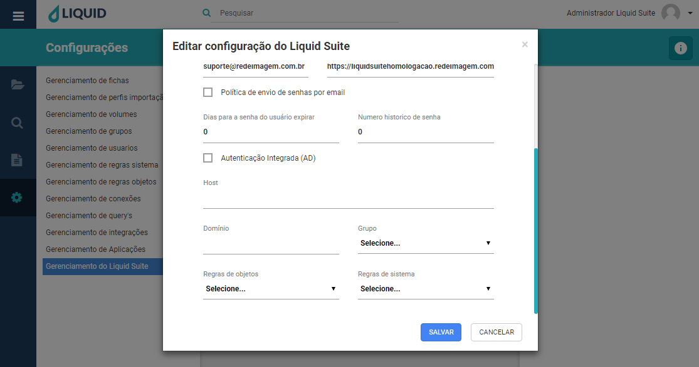

# Liquid Suite - Outros Recursos

#### Integração com Active Directory
Utilize a autenticação integrada com o Active Directory para importar usuários da rede para o Liquid Suite.  

Abra o Gerenciamento do Liquid Suite e Habilite o campo Autenticação Integrada. Preencha os seguintes campos:   

**Host**, determine o host do servidor a ser utilizado.   
**Domínio**, determine o domínio da empresa.   
**Grupo**, selecione o grupo que os usuários do AD serão alocados.   
**Regras de objetos**, selecione as regras de objetos para o grupo.  
**Regras de sistema**, selecione as regras de sistema para o grupo. 

   
Clique no botão **SALVAR**, para salvar a edição na configuração. Caso não deseja salvar, clique no botão **CANCELAR** ou no **X** na parte superior direita da janela.

***Importante:***  
*→ Alguns menus podem estar desabilitados de acordo com os direitos atribuídos ao usuário ou versão contratada. Caso seja necessário utilizar algum recurso que não esteja disponível ao seu usuário, entre em contato com o Supervisor do Liquid.*