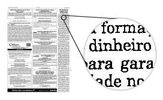

# Liquid Suite - Outros Recursos

#### Optical Character Recognition (OCR) 
O reconhecimento ótico de caracteres (OCR) é uma técnica que consiste em realizar uma varredura na imagem em busca de imagens de palavras que possam ser transformadas em texto. Este texto pode ser indexado para possibilitar uma pesquisa textual sobre o documento posteriormente. Desta forma, ao pesquisar a palavra "dinheiro", o Liquid retornará todos os documentos que possuem esta palavra em sua indexação.  

  

Entretanto, o OCR depende de diversos fatores para possibilitar um bom índice de acerto no reconhecimento das palavras. Fatores como qualidade do papel, tipo de impressão (laser, ink-jet, matricial, máquina de escrever), resolução da digitalização e até mesmo a fonte utilizada no texto podem influenciar no resultado final do OCR.  

A leitura ótica é automática, e está sujeita a problemas de reconhecimento de caracteres semelhantes, como o que ocorre entre os caracteres I (i maiúsculo), l (L minúsculo), 1 (um), j (jota minúsculo) e ! (exclamação). Para manuscritos há procedimentos mais específicos para o reconhecimento ótico de caracteres, também chamado de ICR (Intelligent Character Recognition).  

O algoritmo de varredura OCR está implementado do Liquid apenas para fins experimentais, não sendo recomendado sua utilização efetiva para fins de indexação dos documentos. Para isso, recomendamos a contratação de um serviço especializado onde podem ser utilizados algoritmos mais precisos para cada caso, além de possibilitar que o texto gerado seja "corrigido" manualmente, o que garantiria um índice de eficiência acima de 95%.  

Entre em contato com a Rede & Imagem para obter mais informações sobre o OCR e os serviços disponíveis para esta tecnologia.

***Importante:***  
*→ Alguns menus podem estar desabilitados de acordo com os direitos atribuídos ao usuário ou versão contratada. Caso seja necessário utilizar algum recurso que não esteja disponível ao seu usuário, entre em contato com o Supervisor do Liquid.*