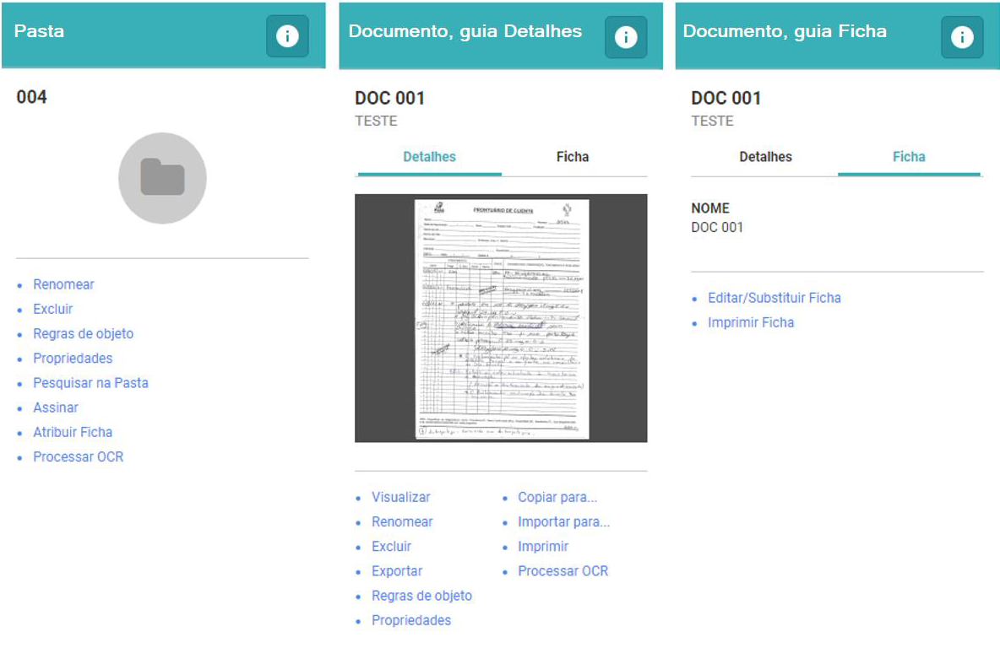

# Liquid Suite - Arquivos

#### Área de informações/Ações  

É dividida em três janelas onde são exibidos as opções e informações para o objeto selecionado.  

* **Pasta**: Exibe o nome da pasta e as opções de ações disponíveis ao usuário sobre a pasta.  
* **Documento, guia Detalhes**: Exibe o nome do documento, logo abaixo o nome da ficha ao qual este documento pertence e as opções de ações disponíveis ao usuário sobre o documento.  
* **Documento, guia Ficha**: Exibe o nome do documento, logo abaixo o nome da ficha ao qual este documento pertence e as opções de ações disponíveis ao usuário sobre a Ficha.  

  