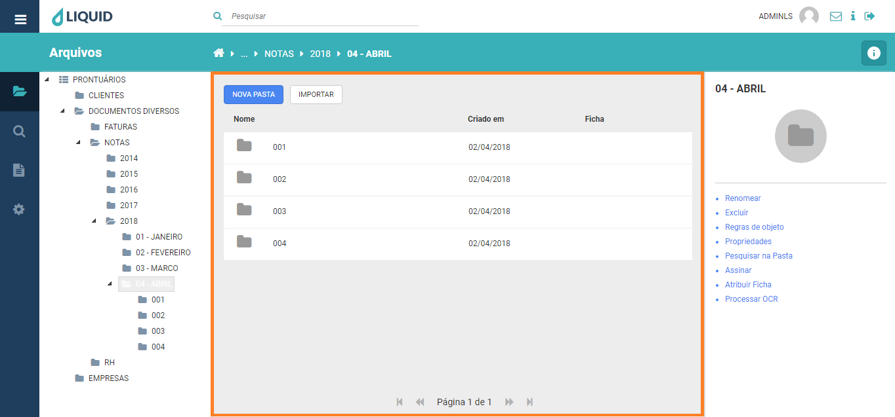

# Liquid Suite - Arquivos

#### Área de trabalho  

Os itens existentes (subpastas e documentos) nas pastas serão exibidos em uma lista.  
No canto esquerdo superior temos:  
* **Nova pasta**: Cria uma nova pasta dentro da estrutura atual selecionada.
* **Importar**: Cria um novo documento.
  
Na parte inferior o *paginador* é habilitado no caso de muitos itens estarem armazenados na pasta selecionada.

Logo abaixo destas opções temos as colunas *Nome*, *Criado em* e *Ficha* que se referem aos itens contidos na pasta atual. Na parte inferior da janela temos os botões de paginação, que permite acessar o restante da lista de itens.  

* **Nome**: Refere-se ao nome de pasta ou documento.    
* **Criado em**: Data em que o documento foi criado no sistema.     
* **Ficha**: O nome da Ficha ao qual pertence o documento.      

  