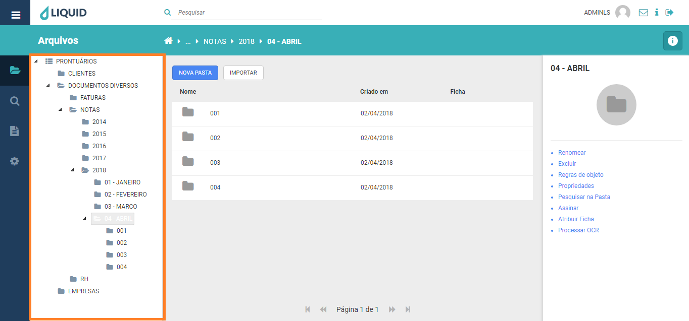

# Liquid Suite - Arquivos

#### Estrutura de pastas 
O usuário pode navegar pelas pastas selecionando-as. Quando uma pasta é selecionada na *Área de Trabalho* é exibido o(s) item(s) que ela contém, e em *Área de /Ações* é disponibilizado as informações e ações disponíveis para a pasta selecionada.  

  