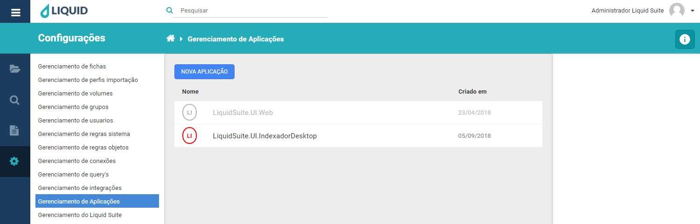
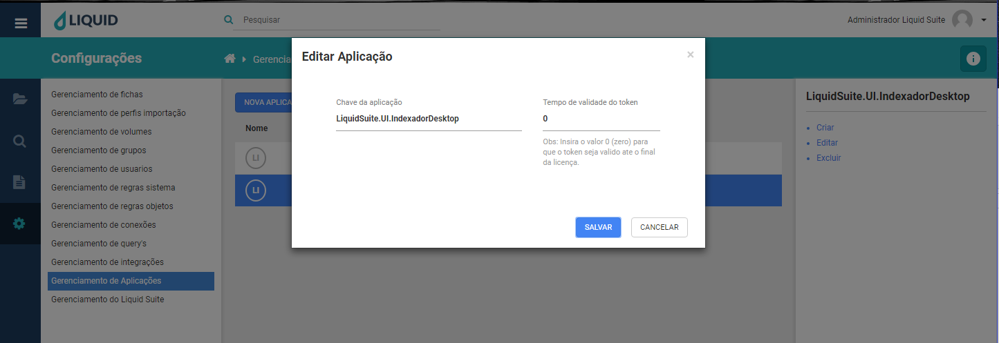
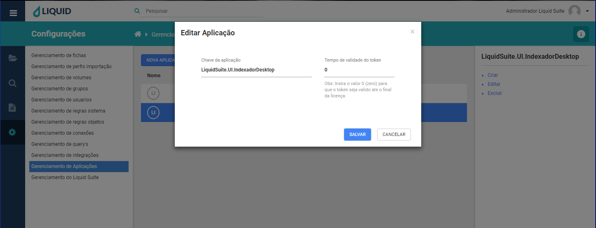
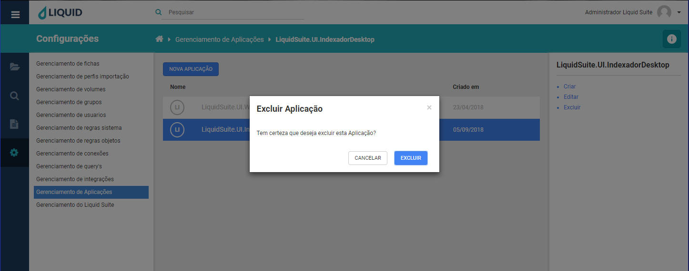

# Liquid Suite - Gerenciamento (Configurações)

#### Gerenciamento de aplicações
Utilize o gerenciamento de aplicações para criar, editar e excluir aplicações do Liquid Suite, é nesta ferramenta que são definidas as aplicações utilizadas.  
No centro, na janela Área de trabalho caso já exista alguma Aplicação configurado no sistema será exibido aqui. Na parte superior temos o botão **NOVA APLICAÇÃO**, logo abaixo a lista de aplicações do sistema com duas colunas, **Nome** que exibe o nome da aplicação, **Criado em** que exibe sua data de criação.  

  

Selecionando uma Aplicação, à direita na Área de Informações/Ações temos o nome da aplicação, logo abaixo as seguintes ações:  

* **Criar**: abre a janela para criação de uma nova aplicação assim como o botão **NOVA APLICAÇÃO**.  
**Chave da aplicação**, determine o nome da aplicação.  
**Tempo de validade do token**, determine se desejar o tempo limite para a aplicação ficar ativa.  

Clique no botão **SALVAR**, para salvar a nova aplicação. Caso não deseja salvar, clique no botão **CANCELAR** ou no **X** na parte superior direita da janela.  

* **Editar**: abre a janela para edição de uma Aplicação já existente, basta selecionar a regra e clicar em **Editar**.  

Clique no botão **SALVAR**, para salvar a edição da aplicação. Caso não deseja salvar, clique no botão **CANCELAR** ou no **X** na parte superior direita da janela.

* **Excluir**: abre a janela para exclusão da Aplicação selecionada.

  
Clique no botão **SALVAR**, para excluir a Aplicação. Caso não deseja salvar, clique no botão **CANCELAR** ou no **X** na parte superior direita da janela.  

***Importante:***   
*→ Alguns menus podem estar desabilitados de acordo com os direitos atribuídos ao usuário ou versão contratada. Caso seja necessário utilizar algum recurso que não esteja disponível ao seu usuário, entre em contato com o Supervisor do Liquid.*