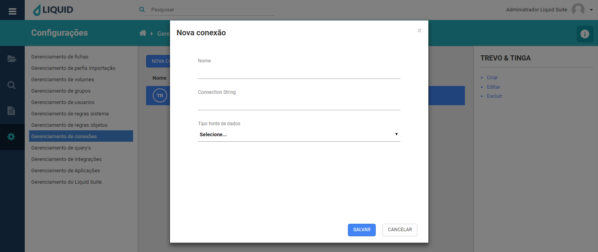
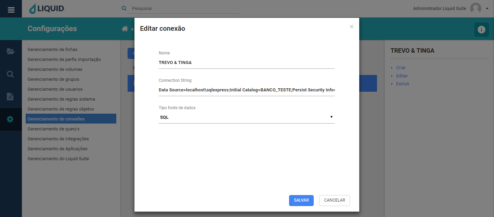
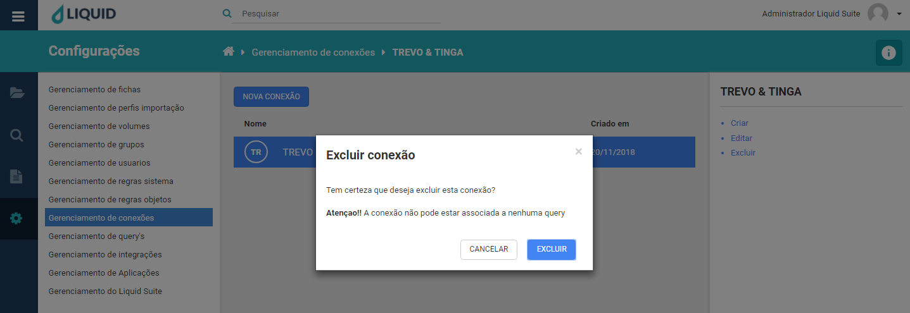

# Liquid Suite - Gerenciamento (Configurações)

#### Gerenciamento de conexões
Utilize o gerenciamento de conexão para criar, alterar ou excluir conexões. Essa ferramenta é responsável pela conexão da aplicação com o banco de dados, SQL ou Oracle.  

* **Criar**: abre a janela para criação de uma nova conexão assim como o botão **NOVA CONEXÃO**. Para a criação de conexão temos as seguintes informações a serem preenchidas.  

**Nome**, determine o nome da conexão a ser criada.  
**Connection String**, determina a conexão com o banco de dados da escolha do usuário.  
**Tipo fonte de dados**, determine qual é o bando de dados utilizados, as duas opções disponíveis são SQL ou Oracle.  

  
Clique no botão **SALVAR**, para salvar a nova conexão. Caso não deseja salvar, clique no botão **CANCELAR** ou no **X** na parte superior direita da janela.  

* **Editar**: abre a janela para edição de uma conexão já existente, basta selecionar a conexão e clicar em **Editar**.  

  
Após editar as opções para uma conexão, clique no botão **SALVAR** para confirmar as alterações. Caso não deseje alterar, clique no botão **CANCELAR** ou no **X** na parte superior direita da janela.  

* **Excluir**: abre a janela para exclusão da Conexão selecionada.  

  
Clique no botão **EXCLUIR**, para excluir a conexão selecionada. Caso não deseja excluir, clique no botão **CANCELAR** ou no **X** na parte superior direita da janela.  

***Importante:***    
*→ Alguns menus podem estar desabilitados de acordo com os direitos atribuídos ao usuário ou versão contratada. Caso seja necessário utilizar algum recurso que não esteja disponível ao seu usuário, entre em contato com o Supervisor do Liquid.*  