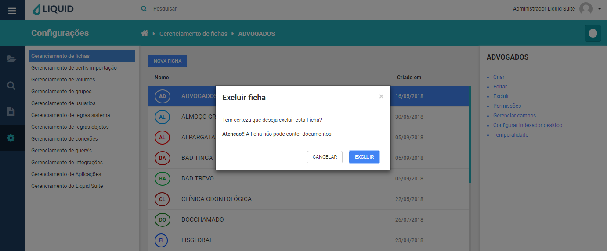
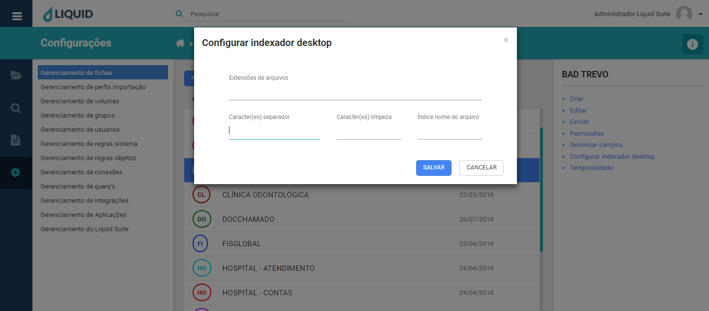

# Liquid Suite - Gerenciamento (Configurações)

#### Gerenciamento de fichas

Utilize o gerenciamento de fichas para criar, alterar ou excluir modelos de fichas de indexação. É nesta ferramenta que são definidos quais campos de índices que serão indexados em cada ficha.  

Clicando no menu principal, em **Configurações** e em **Gerenciamento de fichas**, a janela de gerenciamento é exibida. Sua estrutura é dividida da seguinte maneira:  

À esquerda é mantido o acesso aos outros gerenciamentos do sistema. No centro, na janela Área de trabalho caso já exista alguma ficha criada no sistema, está será exibida aqui. Na parte superior temos o botão **NOVA FICHA**, logo abaixo a lista de fichas do sistema com duas colunas, **Nome** que exibe o nome da ficha, e **Criado em** que exibe a data de criação da ficha.
Botão **NOVA FICHA** abre a janela para criação de fichas (mesma função do item Novo mais a seguir).  

  

Selecionando uma ficha, à direita na Área de Informações/Ações temos o **nome da ficha**, logo abaixo a **descrição** atribuída a ela e na parte inferior as seguintes ações:  

* **Criar**: Clicando sobre o item, abrirá a janela para criação de uma nova ficha no sistema. Aqui inserimos as informações de:  
**Nome da ficha**, identificamos a ficha com um nome.  
**Descrição**, atribui-se a ficha uma descrição, geralmente voltada para seu uso.  
**Ação Documentos com mesmo nome**, este campo determina como o sistema irá proceder ao criar um documento com nome já existente em uma mesma pasta.  
**Criar novo documento**, quando um documento for criado ou movido para uma pasta que já contenha um outro documento com o mesmo nome, esta opção criará um novo documento atribuindo ao final de seu nome um diferenciador. Ex.: “nome (1)”, “nome (2)” ...  
**Adicionar páginas ao início**, o documento é mesclado ao mais antigo, inserindo ao início deste suas imagens.  
**Adicionar páginas ao final**, o documento é mesclado ao mais antigo, inserindo ao final deste suas imagens.  
**Não criar**, o segundo documento não é criado, devendo o usuário buscar a alteração do seu nome.  
**Cor da ficha**, atribuímos aqui uma cor a ficha para uma melhor identificação.
**Certificação Digital**, habilita a ficha para a assinatura digital dos documentos.  

Para finalizar o processo de criação da ficha clique em **SALVAR**, ou em **CANCELAR**caso não deseje criar a ficha. Para sair da janela pode-se clicar também no **X** na parte superior direita da tela e assim cancelar o processo.  

  

* **Editar**: abre a edição da ficha selecionada. Clicando neste item, abrirá a janela para que os dados da ficha selecionada possam ser editados.  

    

Após realizar as modificações clique em **SALVAR**. Caso deseje cancelar o processo clique **CANCELAR** ou no **X** na parte superior direita da janela.  

* **Excluir**: exclui a ficha selecionada. Selecionando este item você pode excluir uma ficha do sistema, para fazê-lo clique em **EXCLUIR**. Caso não deseje finalizar o processo clique em **CANCELAR** ou ainda no **X** na parte superior direita da janela.

Obs.: fichas que contenham documentos armazenados no sistema, não podem ser excluídas. Para excluir uma ficha, primeiro os documentos devem ser excluídos.  

    

* **Permissões**: abre a janela de permissões para edição. Nesta janela atribuímos as permissões de objetos a ficha selecionada. Para entender sobre Regras de Objeto, leia sobre este tópico.  

Temos na parte superior esquerda o nome da janela seguida do nome da ficha. Logo abaixo temos as janelas com as Regras de objetos, onde as regras criadas previamente aparecerão para serem aplicadas aos objetos.  

Para aplicar uma regra, basta selecionar a regra desejada na janela **Regras de objetos** e clicar no botão azul no centro da janela. A regra selecionada será transferida para a janela de **Regras aplicadas**.

  

Clique no botão **SALVAR**, para finalizar o processo ou para cancelar, clique em **CANCELAR** ou no **X** na parte superior direita da janela.  

* **Gerenciar campos**: abre a janela para gerenciamento dos campos da ficha selecionada.  
A janela apresenta-se da seguinte forma:  
Barra superior com o nome da janela seguida do endereço na Breadcrumbs, clicando sobre um nome do endereço a configuração é direcionada para esta seleção. 

Abaixo temos o botão **NOVO CAMPO**. Cria um novo campo para a ficha. Abaixo as colunas:  
**Nome**, busca o nome do campo.  
**Tipo**, que indica qual é o tipo do campo.  
**Ordem**, informa a ordem daquele campo na ficha.  
**Obrigatório**, se ele é um campo de preenchimento obrigatório ou não.  
**Min**, informa a quantidade mínima de caracteres obrigatórios para o preenchimento.  
**Max**, informa a quantidade máxima de caracteres que o campo pode armazenar.     
   
Quando um **Campo** é selecionado, à direita na **Área de Informações/Ações**temos a informação do nome do campo, seu tipo indicado logo abaixo e as ações que podem ser realizadas.

* **Novo campo**: abre a janela para criação de um campo novo para a ficha. Na parte superior esquerda da tela temos a informação de Novo campo seguido do nome da ficha entre parênteses.  

Abaixo um caixa para seleção **Obrigatório?**, que atribui ou não obrigatoriedade ao preenchimento deste campo. **Nome**, para o nome do campo.  
**Ordem**, a ordem que este campo terá na ficha. Temos aqui a observação sobre o posicionamento do campo, caso o campo que está sendo criado seja posicionado no lugar de um já existente, os campos serão reposicionados na ficha.  
**Tipo**, qual é o tipo deste campo. Ao clicarmos em **Selecione...** temos as seguintes opções de tipos de campos:  
*Número inteiro*: armazena números do tipo inteiro, não permitindo caracteres não numéricos e não se pode iniciar com o digito 0 (zero).  
*Texto*: armazena informação de texto de qualquer tipo.  
*CPF*: armazena informação do tipo CPF, uma validação é feita para confirmar se o número informado aqui é do tipo CPF.  
*CNPJ*: armazena informação do tipo CNPJ, uma validação é feita para confirmar se o número informado aqui é do tipo CNPJ.  
*E-mail*: armazena informação do tipo E-mail, uma validação é feita para confirmar se o texto informado aqui é do tipo E-mail.  
*Verdadeiro / false*: armazena informação do lógico, verdadeiro ou falso.  
*Seleção de opção*: armazena informação em uma lista selecionável pelo usuário.  
*Seleção múltipla*: armazena informação em uma lista selecionável pelo usuário, sendo que se pode assinalar mais de uma escolha.  
*Data*: armazena informação de tipo data.  
*Número decimal*: armazena informação do tipo decimal, dígitos numéricos com casas decimal, vírgula (,).  

  

* **Editar**: abre a janela para edição do campo selecionado pelo usuário.

As propriedades do campo, **Obrigatório?**, **Nome**,**Ordem** e **Tipo** podem ser alterados. Após edição, clique em **SALVAR** para validar as alterações, em **CANCELAR** ou no **X** na parte superior direita da janela, caso deseje sair sem realizar alterações.  

  

* **Excluir**: abre a janela exibindo a pergunta se o usuário deseja excluir o campo selecionado. Clicando em **EXCLUIR**, o campo selecionado é apagado da ficha. Para cancelar a alteração, clique em **CANCELAR** ou no **X** na parte superior direita da janela.

   

* **Ativar integração**: Seleciona a integração com o banco de dados, assim sendo preenchido automaticamente os campos, na opção **Selecione...** para assim aparecer os itens para poder fazer a integração. Clicando em **SALVAR** será ativado a integração ao campo, clique em **CANCELAR** ou no **X** na parte superior direita da janela.  

      

* **Configurar indexador desktop**: Indexação de arquivos consiste em definir as palavras-chaves de um documento ou página do documento para buscar o documento futuramente. Na configuração do indexador no campo temos os seguintes campos para selecionar:   
**Data atual(formato)**, busca a data da indexação, buscando a data do computador.  
**Data de criação arquivo(formato)**, busca a data da criação do arquivo.  
**Data modificação arquivo(formato)**, se constar alguma modificação, irá buscar a data da última modificação.  
**Extensão do arquivo**, busca a extensão do arquivo sem o ponto(.) que separa do nome do arquivo.    
**Nome do arquivo**, busca o nome do arquivo completo (com extensão).  
**Nome do arquivo sem extensão**, busca o nome do arquivo (sem extensão).  
**Pasta do arquivo – esquerda para direita**, busca a estrutura de pastas a partir da pasta raiz.    
**Pasta do arquivo – direita para esquerda**, busca a estrutura de pastas a partir da pasta do documento.    
**Tamanho do arquivo em KB**, busca o tamanho do arquivo em KB.
**Texto fixo**, consiste em cadastrar um texto fixo que irá constar em todos as imagens da ficha.    
**Índice do CSV**, a indexação puxa os dados inseridos por um documento CSV(arquivo em texto).    

    
Clicando em **SALVAR** a configuração será aplicado a ficha, clique em **CANCELAR** ou no **X** na parte superior direita da janela.  

* **Configurar indexador desktop**: Na ficha, necessita preencher os itens:
Extensões de arquivos, determine quais são os tipos de arquivos serão lidos pelo indexador.
**Caracter(es) separador**, determine qual o caractere que é separador de dados no arquivo .DAT.  
**Caracter(es) limpeza**, determine qual o caractere que terá a função de fazer a limpeza dos dados.  
**Índice nome do arquivo**, número que será identificado pelo nome do arquivo. 

  
Clicando em **SALVAR** a configuração será aplicado a ficha, clique em **CANCELAR** ou no **X** na parte superior direita da janela.   

* **Temporalidade**: permite a configuração e alteração de datas de expiração de prazo para documentos. Selecionando o item **Ativo**, preencher o **Tempo de Expiração**, logo após terá dois itens após que são **Excluir definitivamente o documento ao expirar** e **Notificar com (x) dias de antecedência**, no caso de selecionar pela notificação, teremos o campo **Enviar notificação aos seguintes e-mails**, sendo necessário preenche-lo para poder notificar. Clicando em **SALVAR** a temporalidade será aplicado a ficha, clique em **CANCELAR** ou no **X** na parte superior direita da janela.  

   

***Importante:***   
***→*** *Alguns menus podem estar desabilitados de acordo com os direitos atribuídos ao usuário ou versão contratada. Caso seja necessário utilizar algum recurso que não esteja disponível ao seu usuário, entre em contato com o Supervisor do Liquid.*   