# Liquid Suite - Gerenciamento (Configurações)

#### Gerenciamento de grupos
Utilize o gerenciamento de grupos para criar, alterar ou excluir grupo. É nesta ferramenta que são definidos quais parâmetros serão atribuídos. Clicando no menu principal, em **Configurações** e em **Gerenciamento de grupos**, a janela de gerenciamento é exibida. Sua estrutura é dividida da seguinte maneira:  

À esquerda é mantido o acesso aos outros gerenciamentos do sistema.  

No centro, na janela Área de trabalho caso já exista algum Grupo configurado no sistema será exibido aqui. Na parte superior temos o botão **NOVO GRUPO**, logo abaixo a lista de grupos do sistema com duas colunas, **Nome** que exibe o nome do grupo, **Criado em** que exibe sua data de criação.  

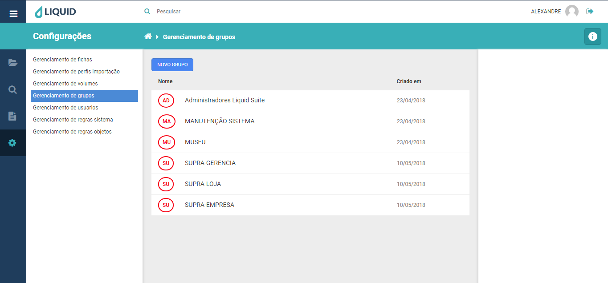  

Selecionando um Perfil de importação, à direita na Área de Informações/Ações temos o nome do perfil, logo abaixo as seguintes ações:  

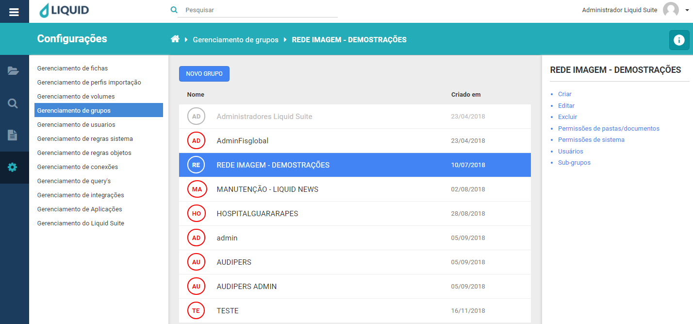  

* Criar: abre a janela para criação de novo volume, assim como o botão **NOVO GRUPO**. Para a criação do volume temos as seguintes informações a serem preenchidas.  

**Nome**, informamos o nome para o novo grupo.  
**Grupo Pai**, informamos de que grupo o novo ser integrado.  
**Restrição de Acesso**, determinasse aqui um período em horas diário para acesso ao sistema pelo grupo.  

  
Clique no botão **SALVAR**, para criar o novo grupo. Caso não deseje criar o grupo, clique no botão **CANCELAR** ou no **X** na parte superior direita da janela.  

* **Editar**: abre a janela para a edição do grupo selecionado.

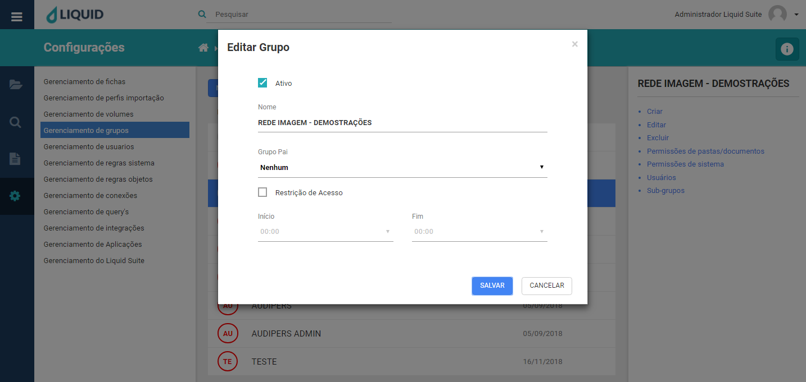  
Clique no botão **SALVAR**, para salvar as alterações no grupo. Caso não deseja realizar as alterações, clique no botão **CANCELAR** ou no **X** na parte superior direita da janela.  

* **Excluir**: abre a janela para exclusão do Grupo selecionado.  

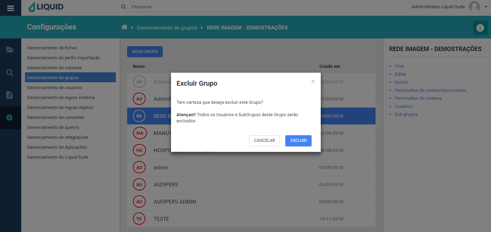  
Clique no botão **EXCLUIR**, para excluir o grupo selecionado. Caso não deseje excluir o grupo, clique no botão **CANCELAR** ou no **X** na parte superior direita da janela.  

* **Permissões de pastas/documentos**: abre a janela de permissões a pastas e documentos. Nesta janela atribuímos as permissões de objetos ao grupo selecionado. Para entender sobre **Regras de Objetos**, leia sobre este tópico.  

Temos na parte superior esquerda o nome da janela seguida do nome do grupo. Logo abaixo temos as janelas com as **Regras de objetos**, onde as regras criadas previamente aparecerão para serem aplicadas.  

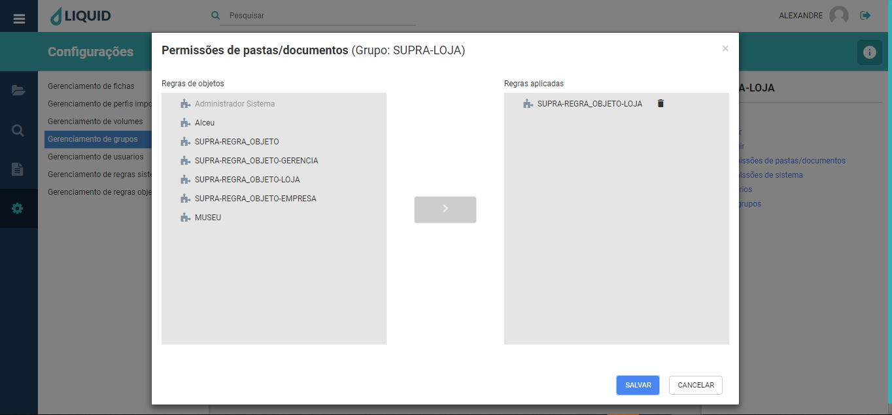  

Para aplicar uma regra, basta selecionar a regra desejada na janela **Regras de objetos** e clicar no botão azul no centro da janela. A regra selecionada será transferida para a janela de **Regras aplicadas**.  

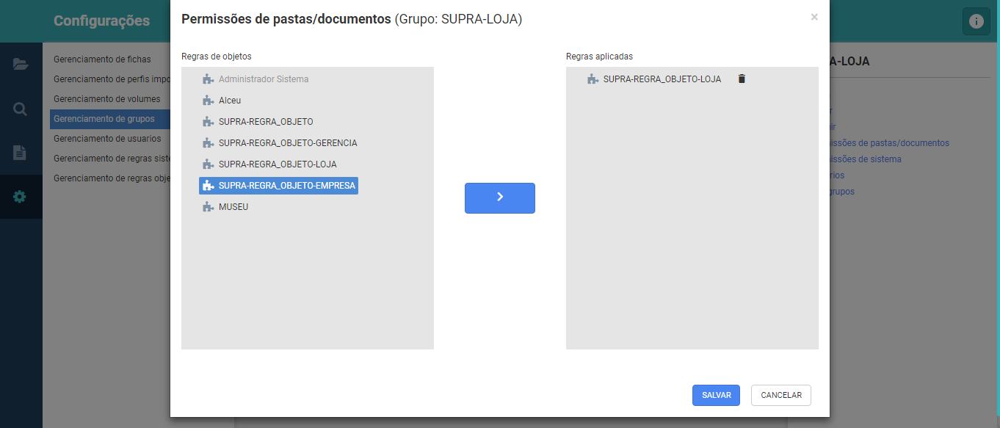  

Clique no botão **SALVAR** para finalizar o processo, para cancelar clique em **CANCELAR** ou no **X** na parte superior direita da janela.

Para excluir uma regra do grupo, selecione a regra desejada na caixa **Regras aplicadas** e clicar sobre o ícone de lixeira.  

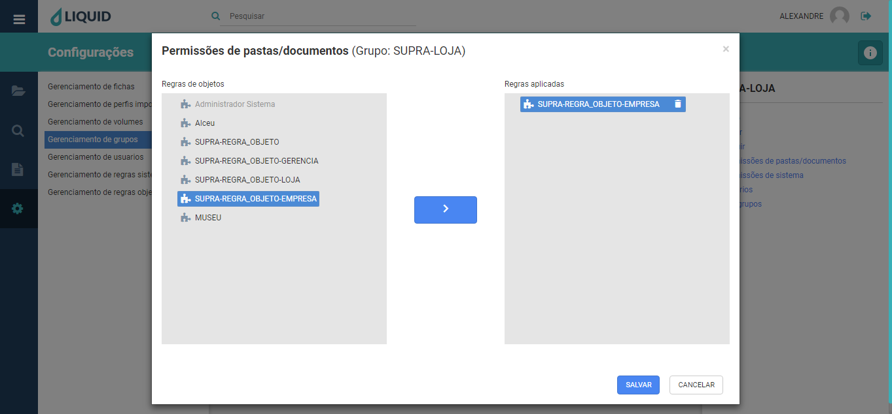  
Clique no botão **SALVAR** para finalizar o processo, para cancelar clique em **CANCELAR** ou no **X** na parte superior direita da janela.  

* **Permissões de sistema**: abre a janela de permissões de acesso ao sistema. Nesta janela atribuímos as permissões de acesso do sistema ao grupo selecionado. Para entender sobre **Regras de Sistema**, leia sobre este tópico.  

Temos na parte superior esquerda o nome da janela seguida do nome do grupo. Logo abaixo temos as janelas com as Regras de sistema, onde as regras criadas previamente aparecerão para serem aplicadas.  

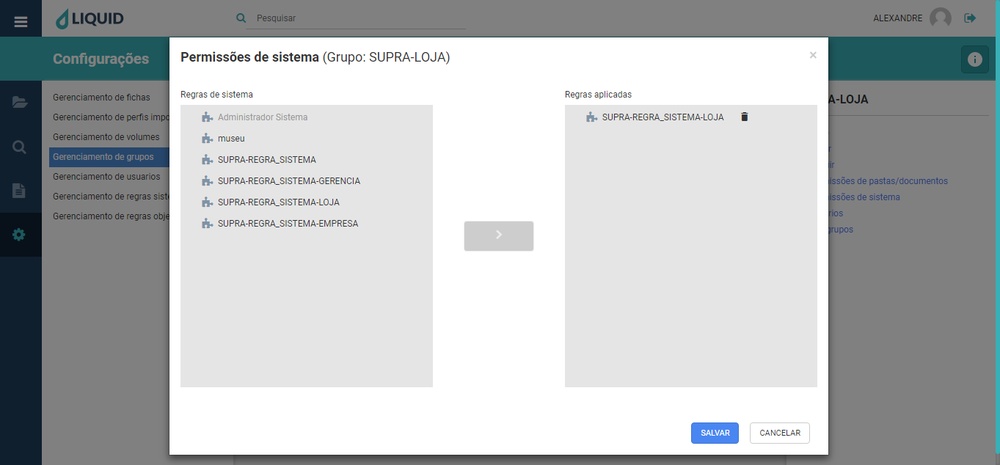  

Para aplicar uma regra, basta selecionar a regra desejada na janela **Regras de sistema** e clicar no botão azul no centro da janela. A regra selecionada será transferida para a janela de **Regras aplicadas**.   

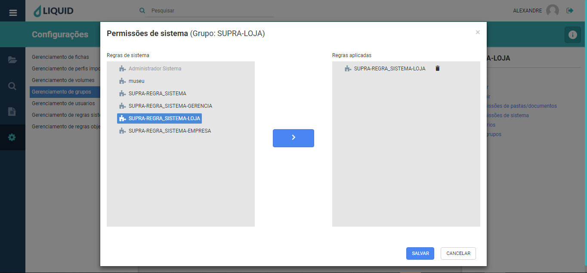 
Clique no botão **SALVAR** para finalizar o processo, para cancelar clique em **CANCELAR** ou no **X** na parte superior direita da janela.  

Para excluir uma regra do grupo, selecione a regra desejada na caixa **Regras aplicadas** e clicar sobre o ícone de lixeira.  

* **Usuários**: abre a janela exibindo o(s) usuário(s) do grupo.

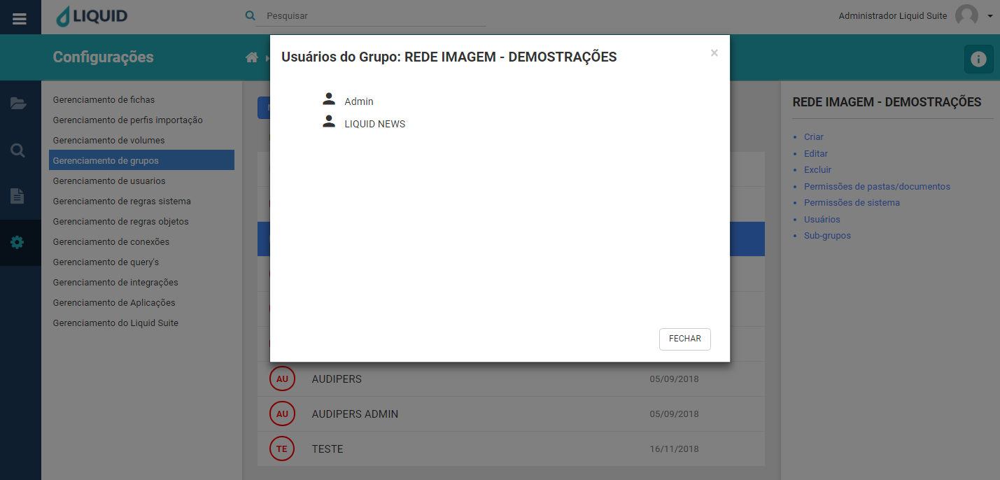  
Para sair da janela, basta clicar em **FECHAR** ou no **X** no canto superior direito.

* **Subgrupos**: abre a janela exibindo o(s) Subgrupo(s) pertencente(s) ao grupo selecionado.

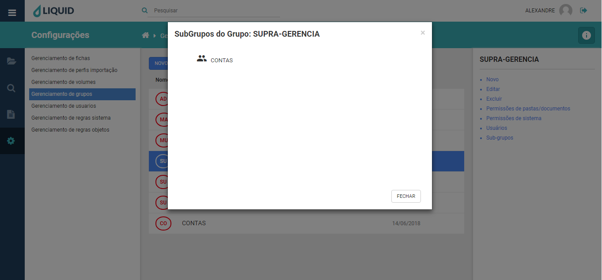   

Para sair da janela, basta clicar em **FECHAR** ou no **X** no canto superior direito.  

**Importante:**    
*→ Alguns menus podem estar desabilitados de acordo com os direitos atribuídos ao usuário ou versão contratada. Caso seja necessário utilizar algum recurso que não esteja disponível ao seu usuário, entre em contato com o Supervisor do Liquid.*  