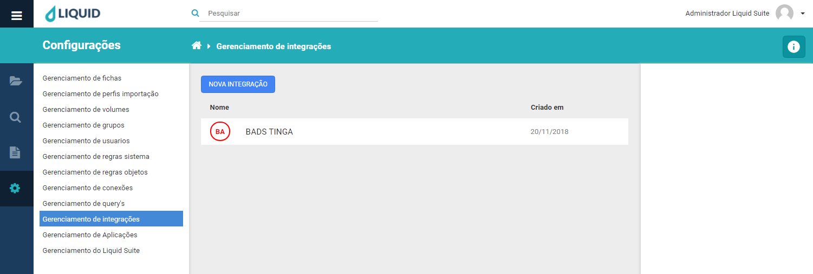
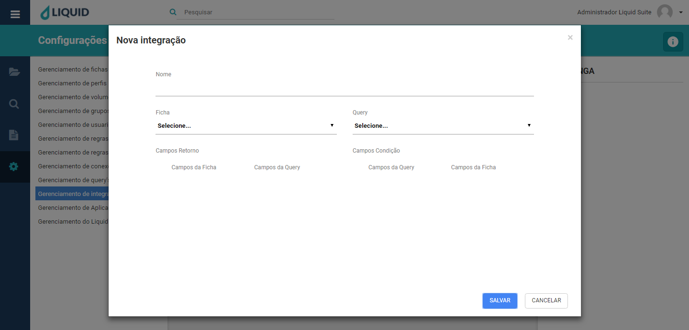
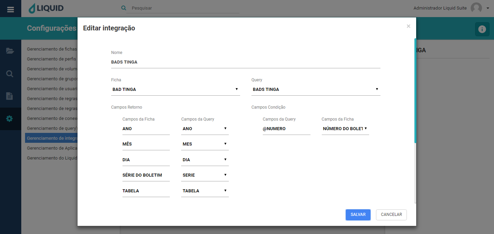
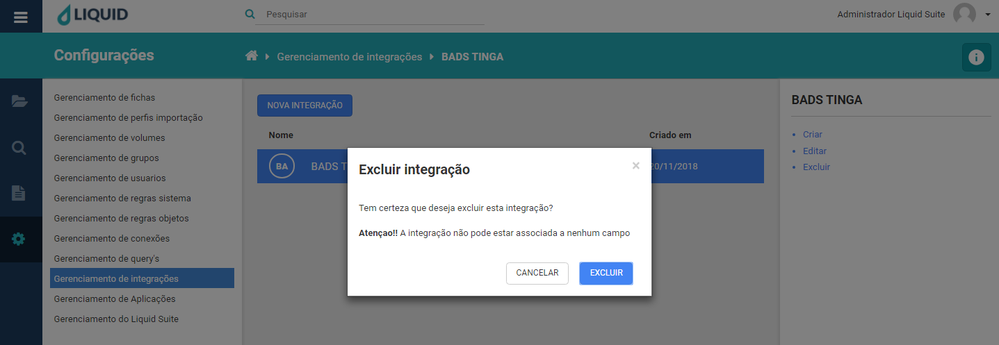

# Liquid Suite - Gerenciamento (Configurações)

#### Gerenciamento de integrações
Utilize o gerenciamento de integrações para criar, alterar ou excluir integrações. Essa ferramenta é responsável pela integração do bando de dados com a ficha. Não é possível ter mais de uma ficha por integração, as integrações são feitas especialmente para cada ficha.  

No centro, na janela Área de trabalho caso já exista alguma Query configurado no sistema será exibido aqui. Na parte superior temos o botão **NOVA INTEGRAÇÃO**, logo abaixo a lista de integrações do sistema com duas colunas, **Nome** que exibe o nome da integração, **Criado em** que exibe sua data de criação.  

 

Selecionando uma Integração, à direita na Área de Informações/Ações temos o nome da integração, logo abaixo as seguintes ações:  

* **Criar**: abre a janela para criação de uma nova conexão assim como o botão **NOVA INTEGRAÇÃO**. Para a criação de uma nova integração temos as seguintes informações a serem preenchidas.  
**Nome**, determine o nome da integração a ser criada.  
**Ficha**, Selecione a ficha que irá fazer a integração com o banco.  
**Query**, selecione a query realizada pelo **Gerenciamento de Query**.  
**Campo de retorno**, visualiza os dados da ficha e da query.  
**Campo de condição**, determine o item que irá trazer em tela o restante das informações da tabela.  

  
Clique no botão **SALVAR**, para salvar a nova integração. Caso não deseja salvar, clique no botão **CANCELAR** ou no **X** na parte superior direita da janela.  

* **Editar**: abre a janela para edição de uma integração já existente, basta selecionar a integração e clicar em **Editar**.  

  
Após editar as opções para uma integração, clique no botão **SALVAR** para confirmar as alterações. Caso não deseje alterar, clique no botão **CANCELAR** ou no **X** na parte superior direita da janela.  

* **Excluir**: abre a janela para exclusão da integração selecionada.

  
Clique no botão **EXCLUIR**, para excluir a integração selecionada. Caso não deseja excluir, clique no botão **CANCELAR** ou no **X** na parte superior direita da janela.  

***Importante:***   
*→ Alguns menus podem estar desabilitados de acordo com os direitos atribuídos ao usuário ou versão contratada. Caso seja necessário utilizar algum recurso que não esteja disponível ao seu usuário, entre em contato com o Supervisor do Liquid.*