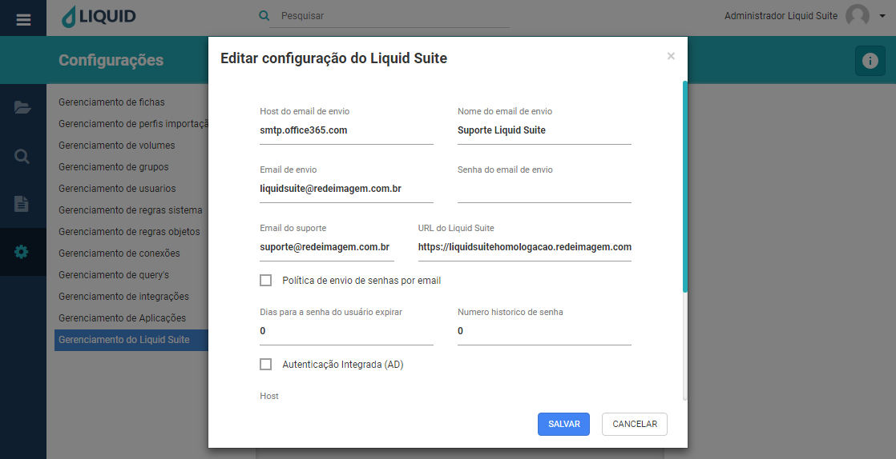

# Liquid Suite - Gerenciamento (Configurações)

#### Gerenciamento do Liquid Suite
O gerenciamento do Liquid Suite é responsável pela configuração da aplicação Liquid Suite, é a ferramenta para gerenciar a aplicação Liquid. Pode-se editar as configurações do Liquid Suite, Clique duas vezes sobre a URL Liquid Suite.  

**Host de e-mail de envio**, determine o hospedeiro do e-mail.  
**Nome do e-mail de envio**, determine o nome para o e-mail de envio.  
**E-mail de envio**, determine o e-mail válido para o envio.  
**Senha do e-mail de envio**, determine a senha do e-mail de envio.  
**E-mail do suporte**, determine o e-mail do suporte.  
**URL do Liquid Suite**, URL do Liquid é determinado pelo nome de cada cliente.   
**Política de envio de senhas por e-mail**, selecione a caixa para o envio de senha pelo e-mail. Dias para a senha do usuário expirar, determine se desejar que a senha do usuário expire, determine dias para a senha expirar.   
**Número histórico de senha**, determine se desejar, o número mínimo de senha antigas que não podem ser usadas novamente.  
**Autenticação integrada**, selecione a caixa de deseja integração com servidor AD.   
**Host**, determine o host do servidor a ser utilizado. Domínio, determine o domínio da empresa.  
**Grupo**, selecione o grupo que os usuários do AD serão alocados.   
**Regras de objetos**, selecione as regras de objetos para o grupo.   
**Regras de sistema**, selecione as regras de sistema para o grupo.  

  
Clique no botão **SALVAR**, para salvar a edição na configuração. Caso não deseja salvar, clique no botão **CANCELAR** ou no **X** na parte superior direita da janela.  

***Importante:***  
*→ Alguns menus podem estar desabilitados de acordo com os direitos atribuídos ao usuário ou versão contratada. Caso seja necessário utilizar algum recurso que não esteja disponível ao seu usuário, entre em contato com o Supervisor do Liquid.*