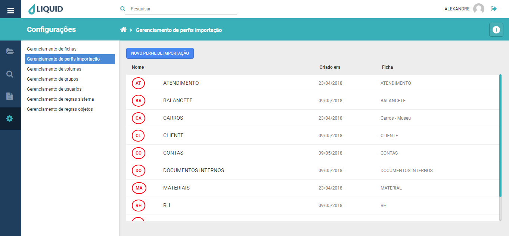
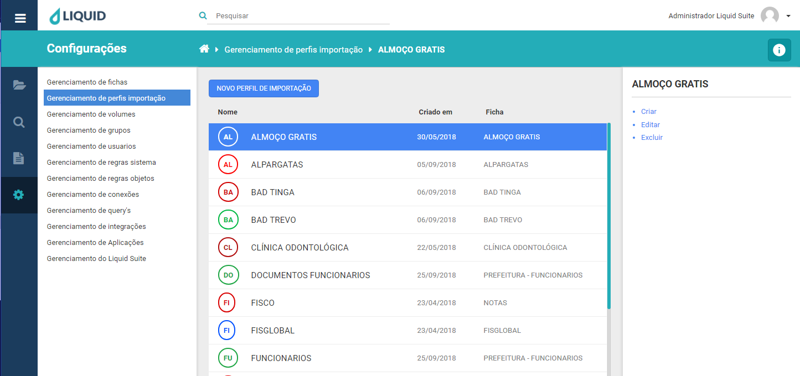
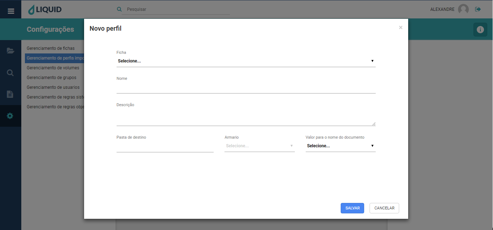
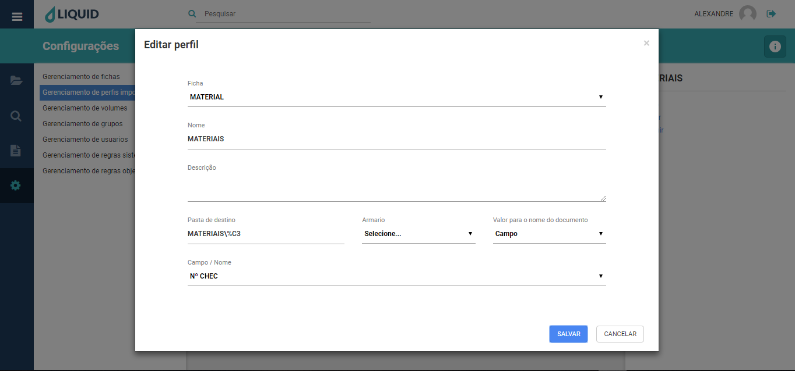
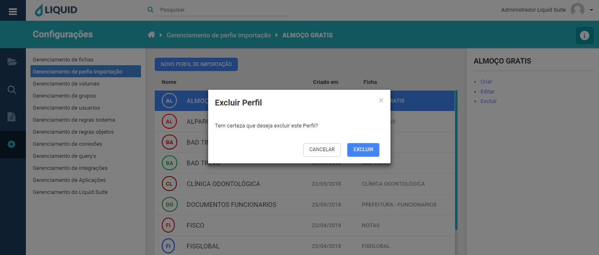

# Liquid Suite - Gerenciamento (Configurações)

#### Gerenciamento de perfis de importação
Utilize o gerenciamento de perfis de importação para criar, alterar ou excluir modelos de perfis de importação. É nesta ferramenta que são definidos quais parâmetros serão atribuídos para a estruturação das pastas no Liquid. Clicando no menu principal, em **Configurações** e em **Gerenciamento de perfis de importação**, a janela gerenciamento é exibida. Sua estrutura é dividida da seguinte maneira:  
À esquerda é mantido o acesso aos outros gerenciamentos do sistema.  

  

No centro, na janela Área de trabalho caso já exista algum Perfil de importação configurado no sistema será exibido aqui. Na parte superior temos o botão **NOVO PERFIL DE IMPORTAÇÃO**, logo abaixo a lista de perfis do sistema com três colunas, **Nome** que exibe o nome do perfil, **Criado em** que exibe sua data de criação e *Ficha*, informa qual ficha pertence o perfil.  

Botão **NOVO PERFIL DE IMPORTAÇÃO**, abre a janela para criação de um novo Perfil de importação, assim como o item Criar logo abaixo.

  

Selecionando um Perfil de importação, à direita na Área de Informações/Ações temos o nome do perfil, logo abaixo as seguintes ações:  

* **Criar**: abre a janela para a criação de um novo Perfil de importação.Para a criação de um perfil temos os seguintes campos:    

**Ficha**, aqui selecionamos a ficha que irá fazer uso do perfil a ser criado.  
**Nome**, informamos qual é o nome deste perfil.  
**Descrição**, descrevemos a finalidade de uso para o perfil.  
**Pasta de destino**, determinamos aqui, qual estrutura de pastas será armazenado o documento, que no momento de sua criação irá utilizar este perfil. Este campo de preenchimento, faz uso de um recurso dinâmico para a criação das pastas que irão armazenar os documentos. Nele podemos utilizar informação fixa (nome digitado pelo usuário) e ou informação dinâmica (nome capturado de campo de índice da ficha). Para melhor entendimento, leia sobre “Campos de índices de indexação”.  
**Armário**, indicamos a qual armário pertence o perfil.  
**Valor para o nome do documento**, determinamos de que forma será criado o nome do documento quando a importação for realizada utilizando o perfil selecionado.  
Temos três opções selecionáveis:  
**Livre**, o usuário digitara o nome do documento no momento da importação.
**Personalizado**, semelhante a “Pasta de destino” explicada acima, podemos usar os mesmos recursos, nome digitado pelo usuário ou capturado do campo de índice da ficha. A forma de aplicação é a mesma.  
**Campo**, determinamos que um campo de índice da ficha será utilizado para dar nome ao documento.  

  
Clique no botão **SALVAR**, para salvar o novo perfil criado. Clique no botão **CANCELAR**, para cancelar a criação do novo perfil ou no **X** na parte superior direita da janela.  

* **Editar**: abre a janela para edição do Perfil selecionado.

Clique no botão **SALVAR**, para salvar as alterações no perfil. Caso não deseja realizar as alterações, clique no botão **CANCELAR** ou no **X** na parte superior direita da janela.

* **Excluir**: abre a janela para exclusão do Perfil selecionado.  

  
Clique no botão **EXCLUIR**, para salvar excluir o perfil selecionado. Caso não deseja excluir o perfil, clique no botão **CANCELAR** ou no **X** na parte superior direita da janela.  

***Importante:***  
*→ Alguns menus podem estar desabilitados de acordo com os direitos atribuídos ao usuário ou versão contratada. Caso seja necessário utilizar algum recurso que não esteja disponível ao seu usuário, entre em contato com o Supervisor do Liquid.*