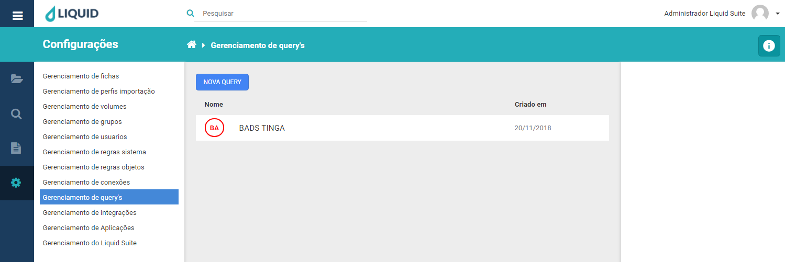

# Liquid Suite - Gerenciamento (Configurações)

#### Gerenciamento de query’s
Utilize o gerenciamento de query’s para criar, alterar ou excluir query’s. Essa ferramenta é responsável pela conexão da tabela de dados no banco, trazendo os dados necessários a partir de uma só informação.
No centro, na janela Área de trabalho caso já exista alguma Query configurado no sistema será exibido aqui. Na parte superior temos o botão **NOVA QUERY**, logo abaixo a lista de query’s do sistema com duas colunas, **Nome** que exibe o nome da query, **Criado em** que exibe sua data de criação.  

  

Selecionando uma Query, à direita na Área de Informações/Ações temos o nome da query, logo abaixo as seguintes ações:  

* **Criar**: abre a janela para criação de uma nova conexão assim como o botão **NOVA QUERY**. Para a criação de uma nova query temos as seguintes informações a serem preenchidas.  
**Nome**, determine o nome da query a ser criada.  
**Conexão**, selecione a conexão do banco de dados realizada no **Gerenciamento de conexão**.  
**SQL Query**, determine a conexão com a tabela do banco de dados SQL.  
**Campo de retorno**, determine os dados da query, como Nome, Serie.  
**Campo de condição**, determine o item que irá buscar em tela o restante das informações do arquivo.  
**Itens seleção**, permite visualização dos **Campo de retorno** e **Campo de condição**.  

  
Clique no botão **SALVAR**, para salvar a nova query. Caso não deseja salvar, clique no botão **CANCELAR** ou no **X** na parte superior direita da janela.  

* **Editar**: abre a janela para edição de uma query já existente, basta selecionar a query e clicar em **Editar**.  

  
Após editar as opções para uma conexão, clique no botão **SALVAR** para confirmar as alterações. Caso não deseje alterar, clique no botão **CANCELAR** ou no **X** na parte superior direita da janela.

* **Excluir**: abre a janela para exclusão da Query selecionada.  

  
Clique no botão **EXCLUIR**, para excluir a query selecionada. Caso não deseja excluir, clique no botão **CANCELAR** ou no **X** na parte superior direita da janela.  

***Importante:***    
*→ Alguns menus podem estar desabilitados de acordo com os direitos atribuídos ao usuário ou versão contratada. Caso seja necessário utilizar algum recurso que não esteja disponível ao seu usuário, entre em contato com o Supervisor do Liquid.*  