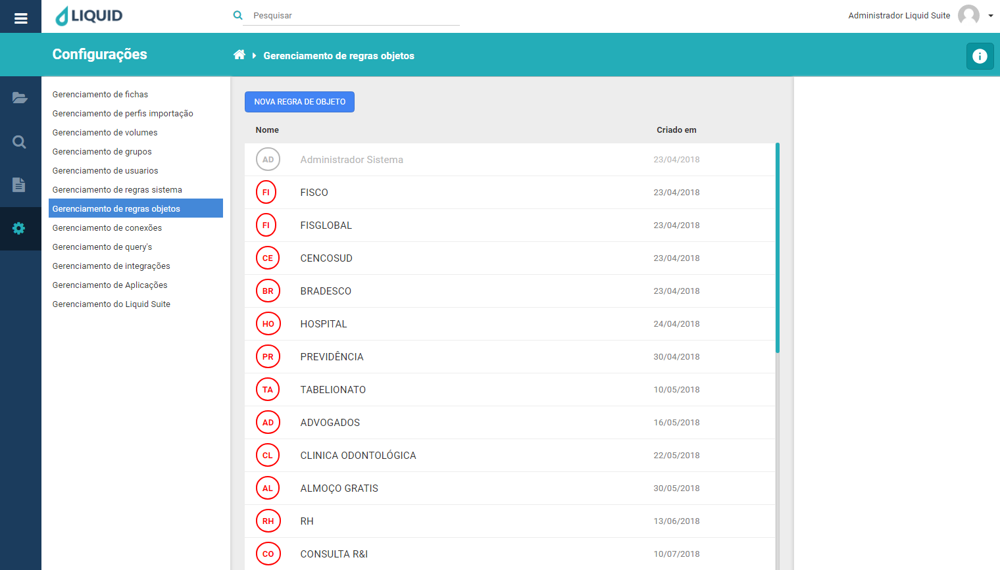
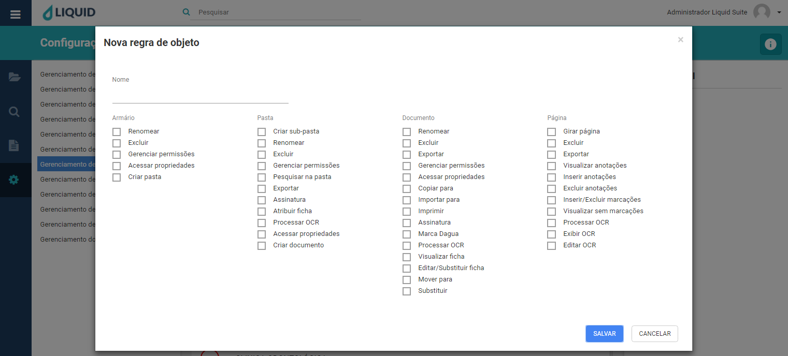
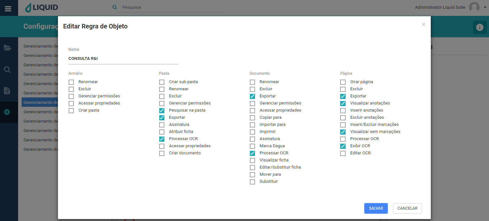
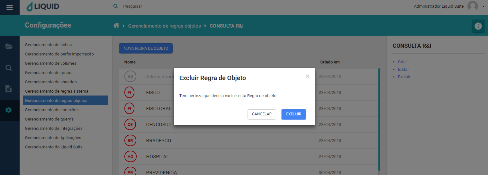

# Liquid Suite - Gerenciamento (Configurações)

#### Gerenciamento de regras de objetos

Utilize o gerenciamento de regras de objetos para criar, alterar ou excluir regras objetos. É nesta ferramenta que são definidos os parâmetros.  

Clicando no menu principal, em **Configurações** e em **Gerenciamento de regras objetos**, a janela de gerenciamento é exibida. Sua estrutura é dividida da seguinte maneira:  

À esquerda é mantido o acesso aos outros gerenciamentos do sistema.
No centro, na janela Área de trabalho caso já exista alguma regra de objeto configurada será exibida aqui. Na parte superior temos o botão **NOVA REGRA DE OBJETO**, logo abaixo a lista das regras de objetos com as colunas, **Nome** que exibe o nome da regra de objetos, **Criado em** que exibe sua data de criação.  

  

Selecionando uma Regra de Objeto, à direita na Área de Informações/Ações temos o nome da regra, logo abaixo as seguintes ações:  

* **Criar**: abre a janela para criação de uma nova regra de objeto assim como o botão **NOVA REGRA DE OBJETO**.  

  

Para a criação de regra de objeto temos as seguintes informações a serem preenchidas.  

**Nome**, determine o nome da regra a ser criada. É por este nome que a regra será identificada no sistema em **Gerenciamento de grupos** e **Gerenciamento de usuários** para ser aplicada de acordo com suas definições a grupos e a usuários.
  
**Níveis de acesso as regras**:  
Refere-se ao quais partes do sistema se tem acesso e o que se pode realizar segundo permissão fornecida. Temos os seguintes níveis, **Armário**, **Pasta**, **Documento** e **Página**.  
     
**Armário**    
Permite o acesso as ações no sistema nos itens abaixo:
**Renomear**: permite edição do nome do armário.  
**Excluir**: permite exclusão do armário.  
**Gerenciar permissões**: permite gerenciar as permissões referentes ao armário.   
**Acessar propriedades**: permite acesso as informações do armário.  
**Criar pasta**: permita a criação de pasta dentro do armário.  
   
**Pasta**  
Permite o acesso as ações no sistema nos itens abaixo:  
**Criar subpasta**: permite a criação de subpastas.  
**Renomear**: permite edição do nome da pasta.  
**Excluir**: permite excluir pasta.  
**Gerenciar permissões**: permite gerenciar permissões para a pasta.  
**Pesquisar na pasta**: permita pesquisa na pasta.  
**Exportar**: permite exportar todos documentos que estão na pasta.  
**Assinatura**: permite assinar todos documentos que estão na pasta.  
**Atribuir ficha**: permite atribuir uma ficha a pasta. Essa atribuição funciona de forma que, toda a vez que um documento é importado para a pasta contendo uma ficha atribuída, ela assumirá os índices de indexação para desta ficha.    
**Processar OCR**: permite processar o OCR (Reconhecimento Ótico de Caracteres) em todos os documentos existentes na pasta.  
**Acessar propriedades**: permite acesso as informações de propriedades da pasta.  
**Criar documento**: permite a criação (importação) de documento para a pasta.  
**Documento**   
Permite o acesso as ações no sistema nos itens abaixo:   
**Renomear**: permite edição do nome de documento.  
**Excluir**: permite excluir documento.  
**Exportar**: permite exportar documento. Faz a cópia de um documento do sistema para a área de transferência.  
**Gerenciar permissões**: permite gerenciar as permissões sobre documentos.  
**Acessar propriedades**: permite acesso as propriedades dos documentos.  
**Copiar para**: permite cópia de um documento de sua pasta origem para uma pasta destino.  
**Importar para**: permite importar imagens para um documento do sistema.  
**Imprimir**: permite imprimir documento.  
**Assinatura**: permite assinar digitalmente documentos.  
**Marca D’água**: permite adicionar Marca D’Água as imagens dos documentos.  
**Processar OCR**: permite processar o OCR (Reconhecimento Ótico de Caracteres) para documentos.   
**Visualizar ficha**: permite visualização da ficha, exibe os campos de índices indexados dos documentos.  
**Editar/Substituir ficha**: permite editar os campos de índices dos documentos e substituir.  
**Mover para**: permite mover documentos de uma pasta para outra.  
**Substituir**: permite substituir imagens de documentos.  
     
**Página**  
Permite o acesso as ações no sistema nos itens abaixo:  
**Girar página**: permite girar (rotacionar) páginas de um documento.  
**Excluir**: permite excluir páginas de um documento.   
**Exportar**: permite exportar (salvar na área de transferência) páginas de um documento.  
**Visualizar anotações**: permite visualizar anotações (textos inseridos por usuários como lembretes ou mensagens) nos documentos.  
**Inserir anotação**: permite a inserção de anotações nos documentos.  
**Excluir anotações**: permite excluir anotações.  
**Inserir anotações**: permite a inserção de anotações nos documentos.  
**Visualizar sem marcações**: permite visualizar os documentos sem marcações.  
**Processar OCR**: permite processar os OCR para documentos.  
**Exibir OCR**: permite exibir o OCR dos documentos.  
**Editar OCR**: permite editar o OCR dos documentos.  

Após preenchimento e seleção das opções para uma Regra de Objeto, clique no botão **SALVAR** para criar a regra. Caso não deseje criar, clique no botão **CANCELAR** ou no **X** na parte superior direita da janela.  

* **Editar**: abre a janela para edição de uma Regra de Objeto já existente, basta selecionar a regra e clicar em **Editar**.  

  
Após editar as opções para uma Regra de Objeto, clique no botão **SALVAR** para confirmar as alterações. Caso não deseje alterar, clique no botão **CANCELAR** ou no **X** na parte superior direita da janela.  

* **Excluir**: abre a janela para exclusão da Regra de Objeto selecionada.  

  
Clique no botão **EXCLUIR**, para excluir a regra selecionada. Caso não deseja excluir, clique no botão **CANCELAR** ou no **X** na parte superior direita da janela.  

***Importante:***    
*→ Alguns menus podem estar desabilitados de acordo com os direitos atribuídos ao usuário ou versão contratada. Caso seja necessário utilizar algum recurso que não esteja disponível ao seu usuário, entre em contato com o Supervisor do Liquid.*   
