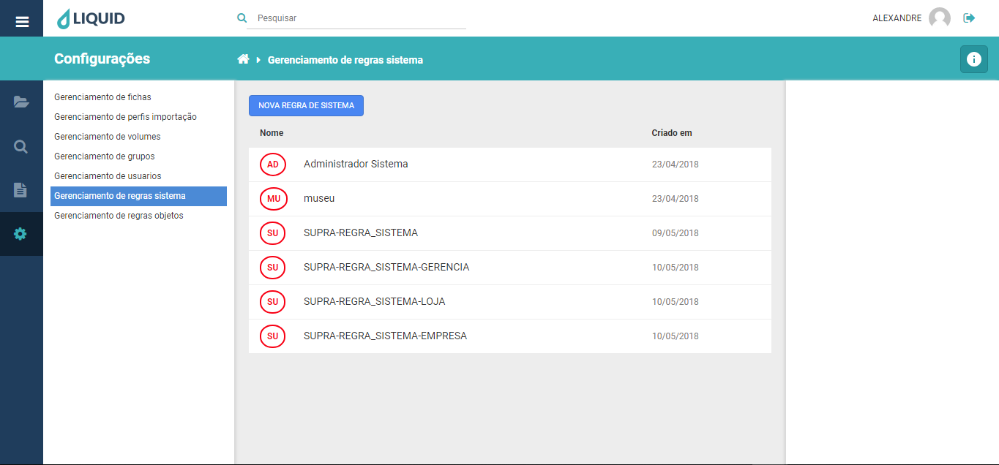
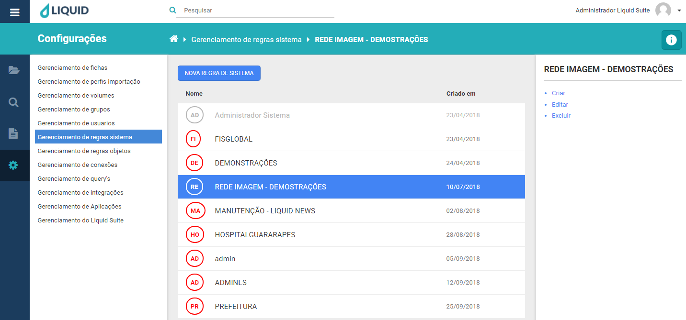
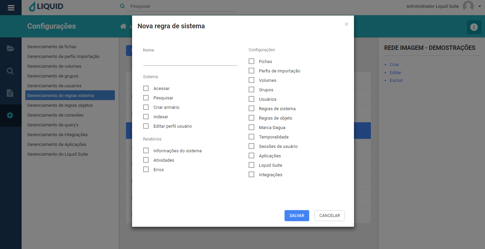
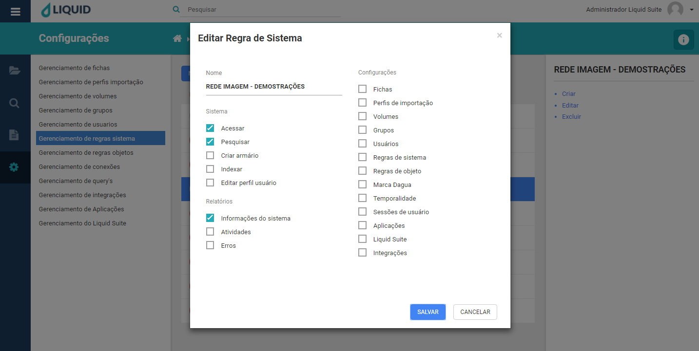
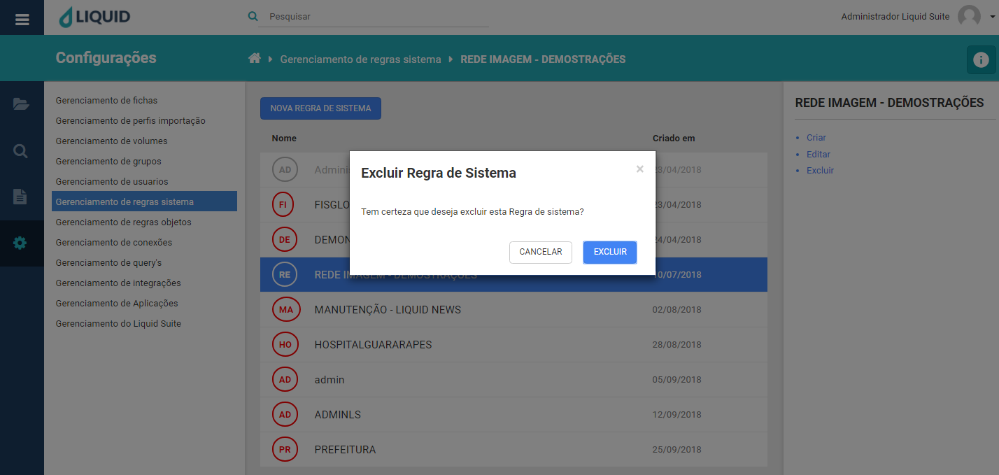

# Liquid Suite - Gerenciamento (Configurações)

#### Gerenciamento de regras do sistema

Utilize o gerenciamento do sistema para criar, alterar ou excluir regras sistema. É nesta ferramenta que são definidos parâmetros.  

Clicando no menu principal, em **Configurações** e em **Gerenciamento de regras** do sistema, a janela de gerenciamento é exibida. Sua estrutura é dividida da seguinte maneira:  

À esquerda é mantido o acesso aos outros gerenciamentos do sistema.  

No centro, na janela Área de trabalho caso já exista alguma regra do sistema configurada será exibida aqui. Na parte superior temos o botão **NOVA REGRA DE SISTEMA**, logo abaixo a lista das regras do sistema com as colunas, **Nome** que exibe o nome da regra do sistema, **Criado em** que exibe sua data de criação.

Selecionando uma Regra de Sistema, à direita na Área de Informações/Ações temos o nome da regra, logo abaixo as seguintes ações:  

  

* **Criar**: abre a janela para criação de uma nova regra de sistema assim como o botão **NOVA REGRA DE SISTEMA**.  

  

**Regras de sistema**: permite a criação, configuração e alteração de regras de sistema.  
**Regras de objeto**: permite a criação, configuração e alteração de regras de objetos do sistema.  
**Marca D’Água**: permite a criação, configuração e alteração de Marca D’Água para aplicação nos documentos.  
**Temporalidade**: permite a configuração e alteração de datas de expiração de prazo para documentos.  
**Sessões de usuário**: permite a criação, configuração e alteração de sessões de usuários.  
 
Após preenchimento e seleção das opções para uma Regra de Sistema, clique no botão **SALVAR** para criar a regra. Caso não deseje criar, clique no botão **CANCELAR** ou no **X** na parte superior direita da janela.  
  
* **Editar**: abre a janela para edição de uma Regra de Sistema já existente, basta selecionar a regra e clicar em **Editar**.  

  

Após editar as opções para uma Regra de Sistema, clique no botão **SALVAR** para confirmar as alterações. Caso não deseje alterar, clique no botão **CANCELAR** ou no **X** na parte superior direita da janela.  
  
* **Excluir**: abre a janela para exclusão da Regra de Sistema selecionada.

  

Clique no botão **EXCLUIR**, para excluir a regra selecionada. Caso não deseja excluir, clique no botão **CANCELAR** ou no **X** na parte superior direita da janela.  

***Importante:***    
*→ Alguns menus podem estar desabilitados de acordo com os direitos atribuídos ao usuário ou versão contratada. Caso seja necessário utilizar algum recurso que não esteja disponível ao seu usuário, entre em contato com o Supervisor do Liquid.*