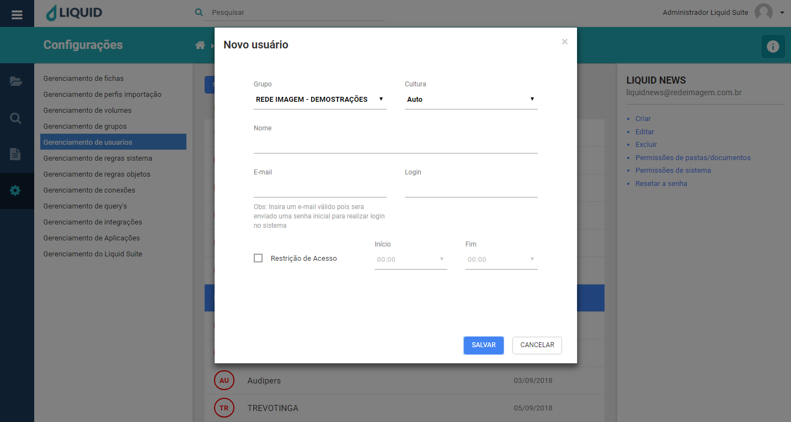

# Liquid Suite - Gerenciamento (Configurações)

#### Gerenciamento de usuários

Utilize o gerenciamento de usuários para criar, alterar ou excluir usuários. É nesta ferramenta que são definidos quais parâmetros serão atribuídos ao usuário. Clicando no menu principal, em **Configurações** e em **Gerenciamento de usuários**, a janela de gerenciamento é exibida. Sua estrutura é dividida da seguinte maneira:  
À esquerda é mantido o acesso aos outros gerenciamentos do sistema.  

No centro, na janela Área de trabalho caso já exista algum usuário configurado no sistema será exibido aqui. Na parte superior temos o botão **NOVO USUÁRIO**, logo abaixo a lista de usuários do sistema com as colunas, **Nome** que exibe o nome do usuário, **Criado em** que exibe sua data de criação.  

  
Selecionando um usuário, à direita na Área de Informações/Ações temos o nome do usuário e e-mail, logo abaixo as seguintes ações:  

* **Criar**: abre a janela para criação de novo usuário, assim como o botão **NOVO USUÁRIO**.  

  

Para a criação do usuário temos as seguintes informações a serem preenchidas.
**Grupo**, selecionasse o grupo ao qual o usuário fará parte. Sendo um campo obrigatório, um usuário sempre pertencerá a um grupo.  
**Cultura**, selecionasse a cultura qual o usuário faz parte, **Auto**, **Português**, **Inglês**.  
**Nome**, informamos o nome para o novo usuário.  
**E-mail**, informamos um endereço de e-mail para o novo ao usuário.  
**Login**, informamos o nome com o qual o usuário irá se logar no sistema.
Restrição de Acesso, aqui habilitasse um período de horas diário, que o usuário irá poder acessar o sistema.  
**Senha**, a senha é enviada automaticamente pelo e-mail informado pelo usuário.  

Clique no botão **SALVAR**, para criar o usuário. Caso não deseje criar, clique no botão **CANCELAR** ou no **X** na parte superior direita da janela.  

* **Editar**: abre a janela para edição do usuário selecionado. 
   

Clique no botão **SALVAR**, para salvar as alterações realizadas. Caso não deseja realizar as alterações, clique no botão **CANCELAR** ou no **X** na parte superior direita da janela.  

* **Excluir**: abre a janela para exclusão do usuário selecionado.  
  
  

Clique no botão **EXCLUIR**, para excluir o usuário selecionado. Caso não deseja excluir, clique no botão **CANCELAR** ou no **X** na parte superior direita da janela.  

* **Permissões de pastas/documentos**: abre a janela de permissões a pastas e documentos. Nesta janela atribuímos as permissões de objetos ao usuário selecionado. Para entender sobre **Regras de Objetos**, leia sobre este tópico.  

Temos na parte superior esquerda o nome da janela seguida do nome do usuário. Logo abaixo temos as janelas com as **Regras de objetos**, onde as regras criadas previamente aparecerão para serem aplicadas.  

  

Para aplicar uma regra, basta selecionar a regra desejada na janela **Regras de objetos** e clicar no botão azul no centro da janela. A regra selecionada será transferida para a janela de **Regras aplicadas**.  

* **Permissões de sistema**: abre a janela de permissões de acesso ao sistema. Nesta janela atribuímos as permissões de acesso ao usuário selecionado. Para entender sobre **Regras de Objetos**, leia sobre este tópico.  

Temos na parte superior esquerda o nome da janela seguida do nome do usuário. Logo abaixo temos as janelas com as **Regras de objetos**, onde as regras criadas previamente aparecerão para serem aplicadas.  

Para aplicar uma regra, basta selecionar a regra desejada na janela **Regras de objetos** e clicar no botão azul no centro da janela. A regra selecionada será transferida para a janela de **Regras aplicadas**.

***Importante:***    
*→ Alguns menus podem estar desabilitados de acordo com os direitos atribuídos ao usuário ou versão contratada. Caso seja necessário utilizar algum recurso que não esteja disponível ao seu usuário, entre em contato com o Supervisor do Liquid.*