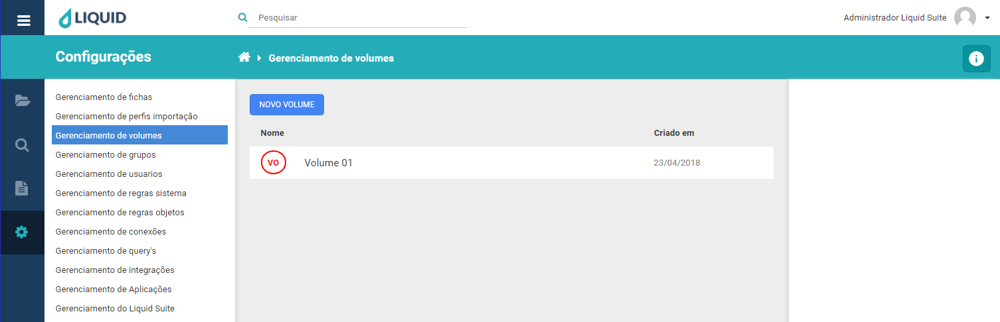
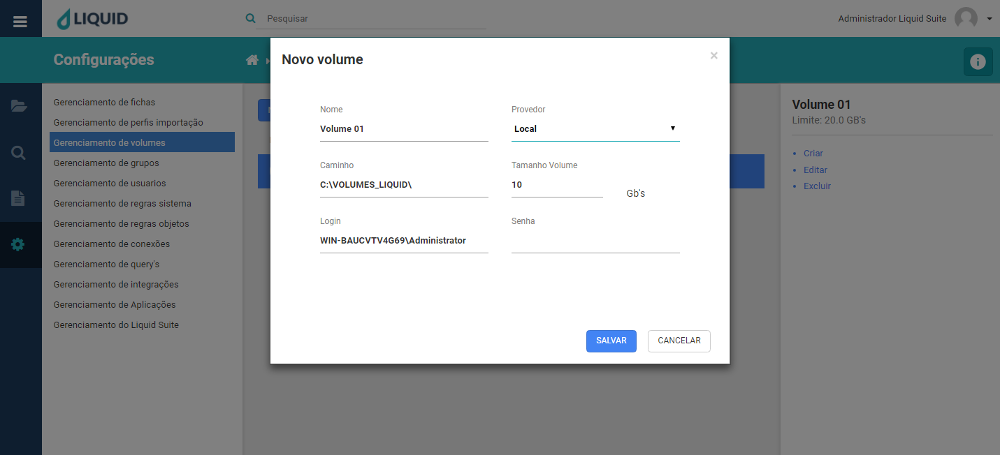
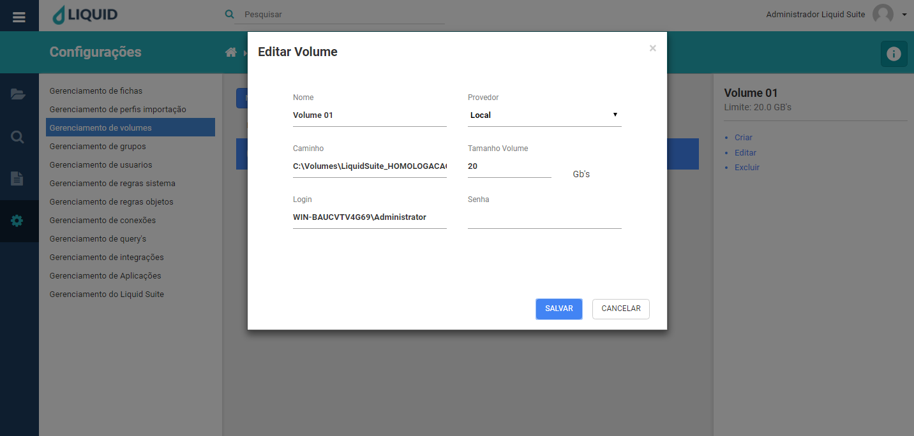
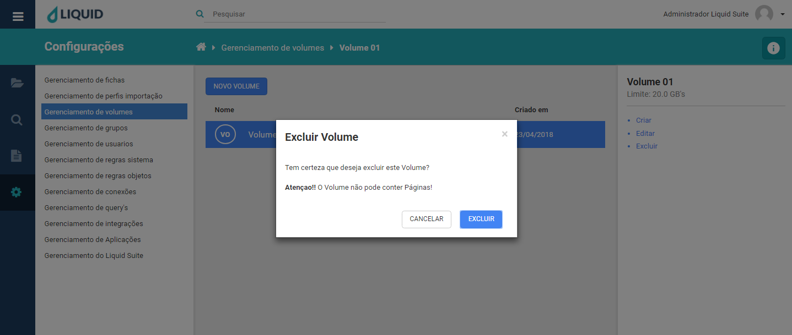

# Liquid Suite - Gerenciamento (Configurações)

#### Gerenciamento de volumes
Utilize o gerenciamento de volume para criar, alterar ou excluir volumes. É nesta ferramenta que são definidos quais parâmetros serão atribuídos ao repositório de imagens no Servidor de Arquivos do Liquid, o **Volume**.  

Clicando no menu principal, em **Configurações** e em **Gerenciamento de volumes**, a janela de gerenciamento é exibida. Sua estrutura é dividida da seguinte maneira:  

À esquerda é mantido o acesso aos outros gerenciamentos do sistema.
No centro, na janela Área de trabalho caso já exista algum Volume configurado no sistema será exibido aqui. Na parte superior temos o botão **NOVO VOLUME**, logo abaixo a lista de volumes do sistema com duas colunas, **Nome** que exibe o nome do volume, **Criado em** que exibe sua data de criação.  

  

Selecionado um Volume à direita é exibido a Área de Informações/Ações. Abaixo temos as informações de nome do volume, abaixo seu limite (capacidade de armazenamento para arquivos físicos). E opções de ações:  

* **Criar**: abre a janela para criação de novo volume, assim como o botão **NOVO VOLUME**.  

  

Para a criação do volume temos as seguintes informações a serem preenchidas.  
**Nome**, informamos o nome para o novo volume.  
**Provedor**, selecionamos o provedor (local) que receberá os arquivos importados para o Liquid.  
**Caminho**, informamos o caminho deste volume, onde encontrasse fisicamente criado o repositório de imagens.  
**Tamanho Volume**, definimos um tamanho limite de armazenamento, capacidade de guarda dos arquivos físicos.  
**Login**, é necessário um login de usuário com as devidas permissões para que seja criado o novo volume.  
**Senha**, é necessária a senha do usuário informado em Login.  

Clique no botão **SALVAR**, para criar o novo volume. Caso não deseja criar o volume, clique no botão **CANCELAR** ou no **X** na parte superior direita da janela.  

* **Editar**: abre a janela para a edição do volume selecionado.  

  
Clique no botão **SALVAR**, para salvar as alterações no volume. Caso não deseja realizar as alterações, clique no botão **CANCELAR** ou no **X** na parte superior direita da janela.  

* **Excluir**: abre a janela para a exclusão do volume selecionado.  
 
  

***Importante:***  
*→ Alguns menus podem estar desabilitados de acordo com os direitos atribuídos ao usuário ou versão contratada. Caso seja necessário utilizar algum recurso que não esteja disponível ao seu usuário, entre em contato com o Supervisor do Liquid.*