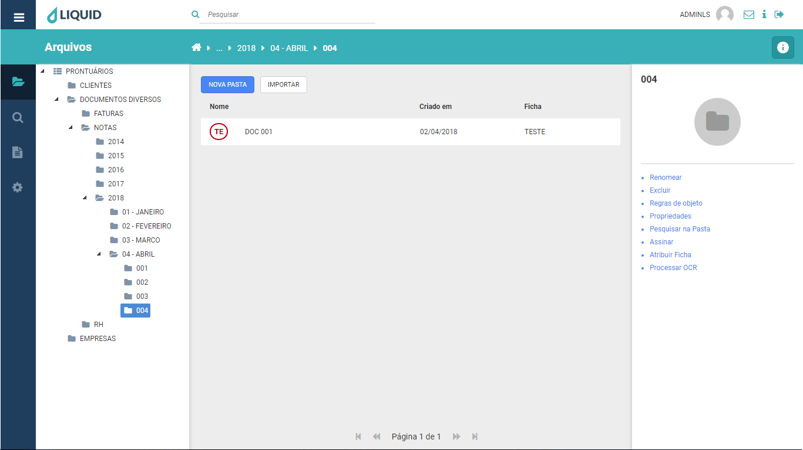

# Liquid Suite - Conhecendo

#### Janela principal  
A área de trabalho do **Liquid Suite** é utilizada para visualização de pastas e listas de documentos, assim também como para acessos a menus de configurações e informações.    

    
A janela principal é dividida em:  

[Barra Superior](barraSuperior.md)  
[Menu Principal](menuPrincipal)  
[Campo de pesquisa rápida](campoPesquisa.md)  
[Menu do usuário](menuUsuario.md)  