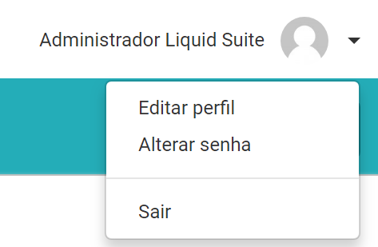
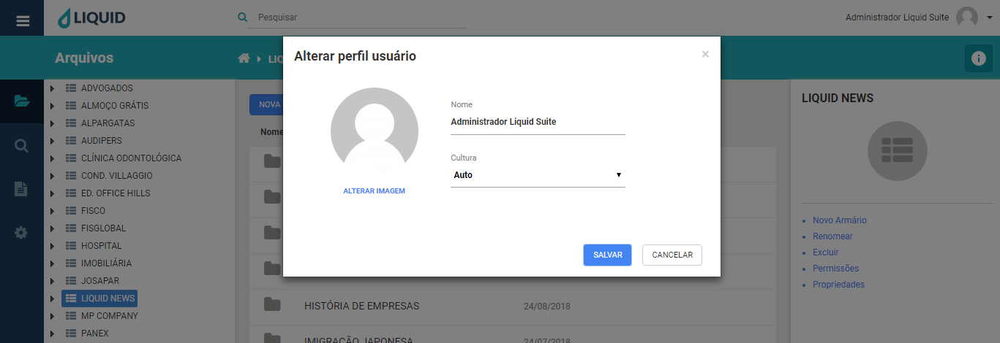
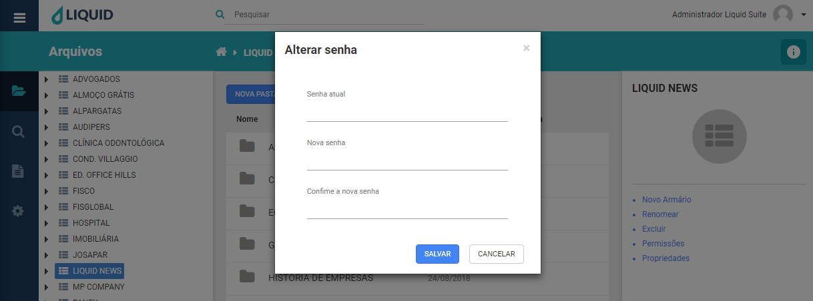

# Liquid Suite - Conhecendo

#### Menu do usuário  
Temos o nome do usuário, acompanhado por uma foto. Temos a opção de Editar Perfil e Alterar senha, sendo possível editar esses campos com permissões necessárias pelo sistema.  

  

* **Editar perfil**: Edita dados que são:  
**Nome**, digite se desejar alterar o novo nome do usuário.  
**Cultura**, selecione se desejável a nova cultura, Auto, Português, Inglês.  
**Alterar imagem**, é possível trocar a imagem do usuário, buscando a imagem pelo computador.  

  
Após preenchimento e seleção da opção para alterar o perfil, clique no botão **SALVAR** para salvar a alteração. Caso não deseje alterar, clique no botão **CANCELAR** ou no **X** na parte superior direita da janela.

* **Alterar senha**: Caso deseje alterar a senha do usuário, preencha esses campos:   
**Senha atual**, digite a senha atual do usuário.  
**Nova senha**, digite a nova senha respeitando os requisitos do sistema.  
**Confirme a nova senha**, digite novamente a nova senha para a alteração desejada.  

  

Após preenchimento das opções para alterar a senha, clique no botão **SALVAR** para salvar a alteração. Caso não deseje alterar, clique no botão **CANCELAR** ou no **X** na parte superior direita da janela.