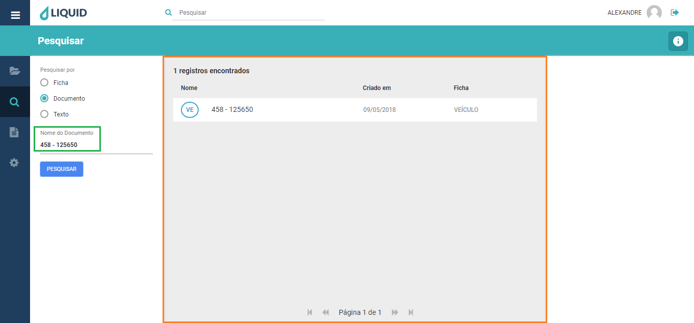

# Liquid Suite - Pesquisa  

#### Pesquisa por Documentos  
A pesquisa por documento é utilizada para localizar um documento pelo seu nome de exibição no sistema. O nome de exibição é o nome que aparece na lista de documentos na *Área de retorno da pesquisa*.  

Para localizar um documento através de seu nome, clique no botão *Menu principal* e selecione a sessão *Pesquisa*.  

A janela de pesquisa será exibida. Selecionando o tipo de pesquisa por Documento, em **Nome do Documento** digite o nome de documento ao qual deseja fazer a busca. Clique em **Pesquisar**.  

Os documentos com o nome pesquisado serão exibidos na **Área de retorno da pesquisa**.

**Obs.**: Aqui pode ser usado o \* (asterisco) como caractere coringa para fazer a busca por nomes. Basta colocá-lo no início ou no final da palavra, em ambos ou ainda para substituir uma letra (caractere especial) que a palavra buscada possa conter, caso não saiba como a mesma foi escrita.