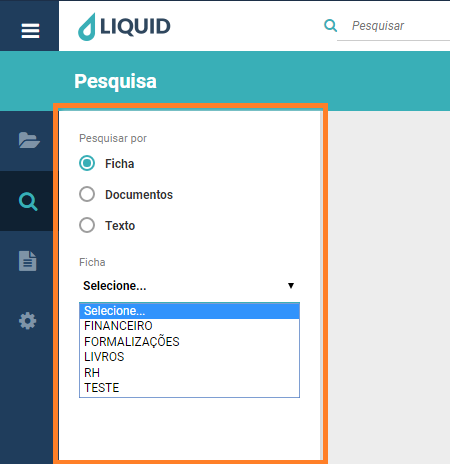
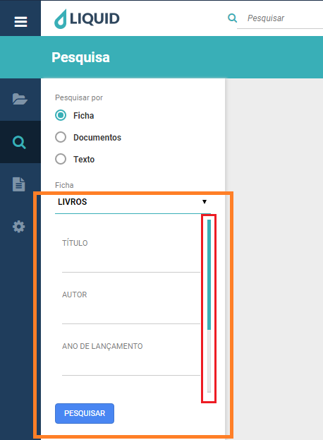
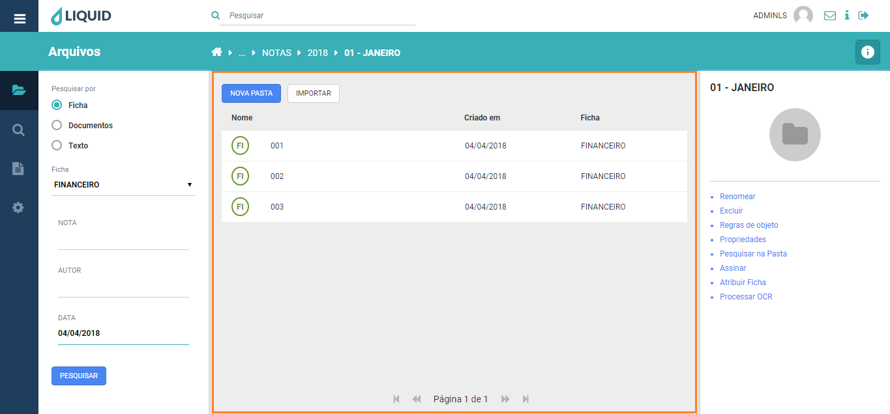
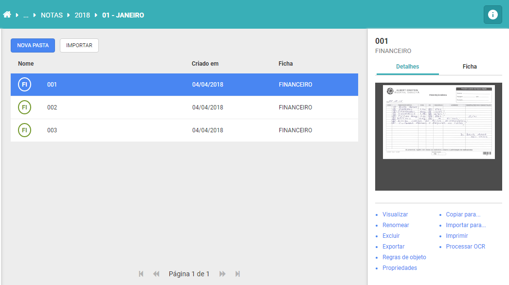
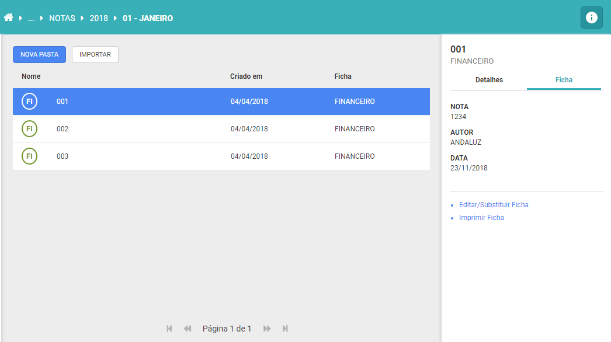

# Liquid Suite - Pesquisa  

#### Pesquisa por Ficha  
A pesquisa por ficha é utilizada para localizar um documento através de seus dados cadastrais. Estes dados são alimentados na *ficha de indexação* no momento da *criação* do documento ou alterado posteriormente através das ferramentas de *edição de ficha* e substituição de ficha.  

Para localizar um documento através de seus índices cadastrados, clique no botão *Menu principal* e selecione a sessão Pesquisa.  

A janela de pesquisa será exibida. Selecionando o tipo de pesquisa por ficha, em **Pesquisa por** e selecione o modelo de ficha que será pesquisada.

  

Os campos da ficha selecionada serão exibidos. Preencha os campos de índices desejados e clique em ***Pesquisar***. Caso alguns campos fiquem ocultos, utilize a ***barra lateral de rolagem*** para acessa-los.  

Se nenhum campo de índice for preenchido, a pesquisa irá retornar todos os documentos existentes no sistema para a ficha pesquisada.    

  

Os documentos filtrados na busca serão apresentados em uma lista na janela central, *Área de retorno da pesquisa*.

  

Selecionando um documento, é exibida a miniatura da primeira imagem do documento, assim como as ações disponíveis para o documento na *guia Detalhes*.

  

Na *guia Ficha* é exibido os campos indexados para o documento e as ações disponíveis.

  

***Notas sobre indexação textual no Liquid***:
* *Palavras com menos de 2 caracteres não são cadastradas;*
* *Palavras acentuadas com til (ã), circunflexo (ô), crase (à) ou agudo (á) podem ser digitadas normalmente,mas terão seus acentos desconsiderados na pesquisa;*  
* *Os seguintes caracteres são ignorados na pesquisa textual: " ´ ` ' ( ) { } [ ] ^ ~ : ; ! ? , . / | \ \**
* *O caractere asterisco ( * ) pode ser utilizado como coringa, ou seja, utilize-o para pesquisas parciais,desta forma representa "qualquer coisa" antes ou depois da palavra digitada;*
* *Os textos são separados por espaços ou pelos caracteres citados no item anterior.*  

***Importante***:  
**→** *Alguns menus podem estar desabilitados de acordo com os direitos atribuídos ao usuário ou versão contratada. Caso seja necessário utilizar algum recurso que não esteja disponível ao seu usuário, entre em contato com o Supervisor do Liquid.*