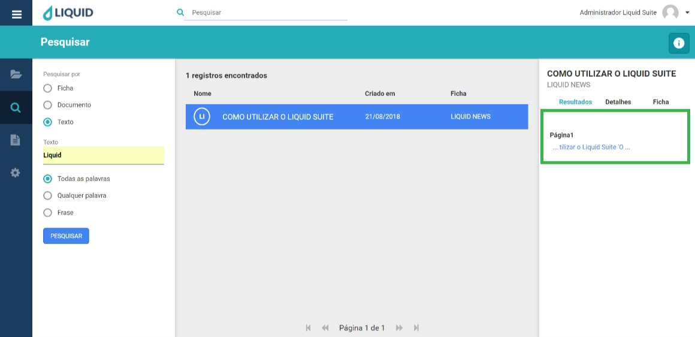

# Liquid Suite - Pesquisa  

#### Pesquisa por Texto  
A pesquisa textual é utilizada para localizar um documento através de seu texto indexado. O texto indexado pode ser obtido automaticamente ou manualmente, conforme descrito no tópico *Indexação Textual de Documentos*.  

Para localizar um documento através de seu texto, clique no botão Menu principal e selecione a sessão Pesquisa.  

A janela de pesquisa será exibida. Selecionando o tipo de pesquisa por Texto, em Texto digite as palavras ao qual deseja fazer a busca. Clique em Pesquisar.  

**Obs.**: Logo abaixo, temos três opções para a busca das palavras digitadas para a busca.  

* **Todas as palavras**: a pesquisa retornará resultados que contenham todas as palavras informadas.  
* **Qualquer palavra**: a pesquisa retornará resultados que contenham qualquer uma das palavras digitadas no campo de texto da busca. Este tipo de pesquisa costuma gerar resultados mais abrangentes.  
* **Frase**: o resultado da pesquisa trará exatamente a frase informada na busca, todas as palavras e na exata ordem digitada.  

Os documentos com as palavras pesquisadas serão exibidos na *Área de retorno da pesquisa*. A direita na *Área de Informações/Ações* em Ficha, na guia Ficha, temos indicas as páginas onde as palavras pesquisadas aparecem.  

  

***Notas sobre indexação textual no Liquid***:
* *Palavras com menos de 2 caracteres não são cadastradas;*
* *Palavras acentuadas com til (ã), circunflexo (ô), crase (à) ou agudo (á) podem ser digitadas normalmente,mas terão seus acentos desconsiderados na pesquisa;*  
* *Os seguintes caracteres são ignorados na pesquisa textual: " ´ ` ' ( ) { } [ ] ^ ~ : ; ! ? , . / | \ \**  
* *O caractere asterisco ( * ) pode ser utilizado como coringa, ou seja, utilize-o para pesquisas parciais,desta forma representa "qualquer coisa" antes ou depois da palavra digitada;*  
* *Os textos são separados por espaços ou pelos caracteres citados no item anterior.*  

***Importante***:  
**→** *Alguns menus podem estar desabilitados de acordo com os direitos atribuídos ao usuário ou versão contratada. Caso seja necessário utilizar algum recurso que não esteja disponível ao seu usuário, entre em contato com o Supervisor do Liquid.*