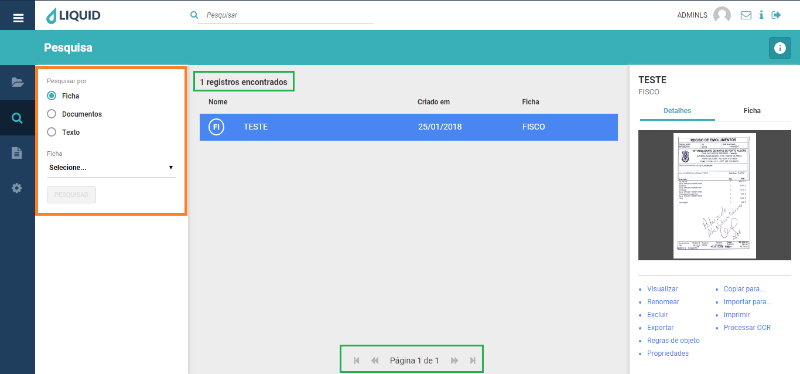

# Liquid Suite - Pesquisa  

#### Pesquisas  
A esquerda temos os tipos de pesquisas que podem ser realizadas no sistema. Pesquisa por *Ficha*, *Documentos* e *Texto*.  

A Área de *Informações/Ações* continua com as mesmas funções ao selecionar um documento.  

Ao centro, temos a *Área de retorno da pesquisa*, nela, na parte superior é exibido a quantidade de *registros encontrados* ao final de uma pesquisa, e na parte inferior temos o *paginador*.  

