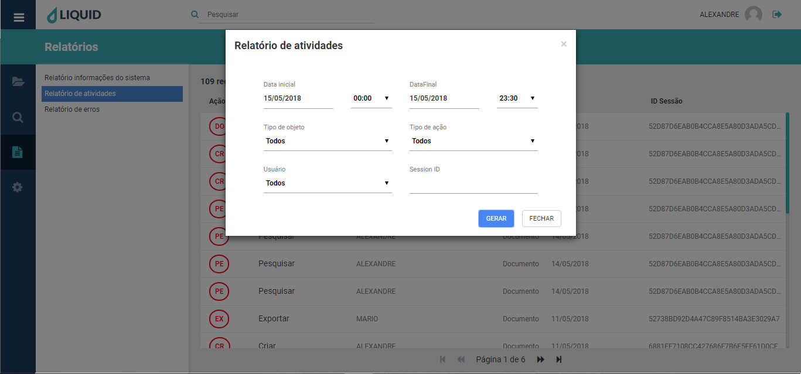
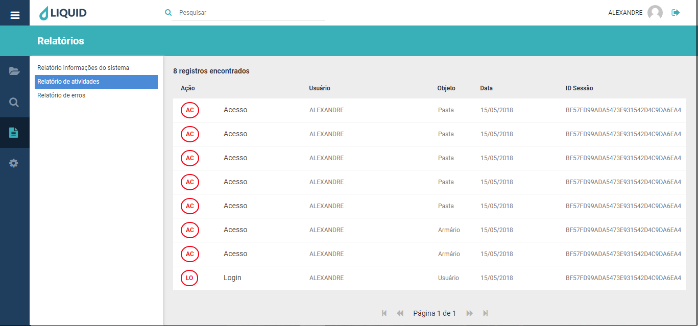
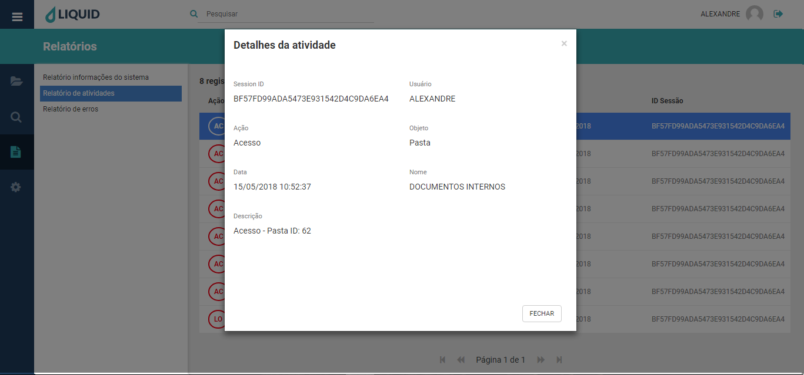

# Liquid Suite - Relatórios  

#### Relatório de atividades   

Informa todas as ações realizadas no sistema, um formato de auditoria. Acessando o Relatório de atividades, temos filtros de busca, que auxiliam na procura por ações mais específicas realizadas no sistema.  

**Data inicial**: Serve para informar uma data de início para a pesquisa, onde determino o período mais antigo para a busca solicitada. Também posso determinar o horário inicial que esta pesquisa terá.  
**Data final**: Serve para informar uma data de fim para a pesquisa, onde determino o período mais atual para a busca solicitada. Também posso determinar o horário final que esta pesquisa terá.  

Obs.: se nenhum período de data for escolhido o software sempre utilizará o período exibido na janela. Por padrão este período é sempre o dia atual, com o início de horário as 0 (zero) horas até as 23:30 horas.  
**Tipo de objeto**: apresenta uma lista de todos os objetos existentes no sistema, tais como, documento, ficha, usuário e etc...  
**Tipo de ação**: apresenta uma lista de todas as ações possíveis no sistema, tais como, criar, excluir, acessar e etc...  
**Usuário**: exibe uma lista de todos os usuários cadastrados no sistema.  
**ID Sessão**: exibe qual o código da sessão que realizou a ação.  
Para efetuar a busca, determine os filtros desejados e clique em GERAR ou FECHAR para cancelar a pesquisa.  

Janela de pesquisa:
  

Janela de retorno da pesquisa:  
  

No retorno da pesquisa solicitada temos as seguintes informações:  
**Ação**, informa qual tipo de ação realizada pelo usuário.  
**Usuário**, informa qual usuário executou determinada ação.  
**Objeto**, informa qual item do sistema sofreu a ação executada pelo usuário.  
**Data**, informa qual data foi executada a ação sobre o objeto.  
**Session ID**, informa qual o código da sessão que realizou a ação.  
Na parte superior esquerda da janela, temos a quantidade de **Registros encontrados** para os filtros aplicados na pesquisa. No rodapé da página temos o **Paginador**, que permite acessar mais ocorrências caso existam outras páginas para a pesquisa executada.  
Clicando duas vezes sobre um registro abrirá a janela **Detalhes da atividade**:

Em **Detalhes da atividade**, temos a visualização completa com mais 2 itens:  
**Nome**, refere-se ao nome da pasta acessada.  
**Descrição**, refere-se ao tipo de ação executada e o ID da pasta acessada.  
Para sair da janela, clique em **FECHAR** ou sobre o **X** na parte superior direita.  