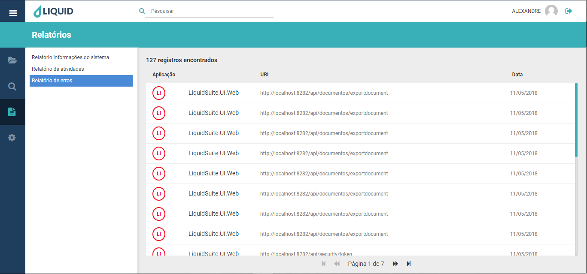
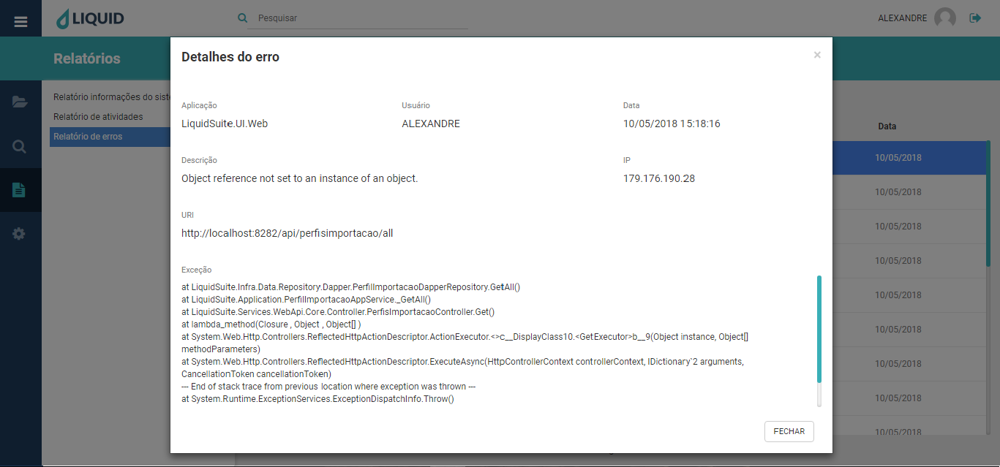

# Liquid Suite - Relatórios  

#### Relatório de erros  
Informa todos os erros ocorridos no sistema.  
  

Na janela do registro dos erros, temos as seguintes informações:  
**Aplicação**, informa em qual aplicação ocorreu o erro.  
**URL**, informa a URL que corresponde o erro ocorrido.  
**Data**, informa a data que o erro ocorreu.  
Na parte superior esquerda da janela, temos a quantidade de **Registros encontrados**. No rodapé da página temos o **Paginador**, que permite acessar mais ocorrências caso existam outras páginas com registros.  
Clicando duas vezes sobre um registro abrirá a janela **Detalhes do erro**:

    

Em **Detalhes do erro**, temos a visualização completa com mais 4 itens:  
**Usuário**, informa o nome do usuário Liquid que através de seu login disparou o erro.  
**Descrição**, mostra a mensagem de erro.  
**IP**, informa o Internet Protocol (Protocolo da Internet), local que disparou o erro.  
**Execução**, informa o trace do erro. Obs.: Utilize a barra de rolagem ou o botão central do mouse para exibir o restante do erro, caso parte esteja oculto na janela.  

Para sair da janela, clique em **FECHAR** ou sobre o **X** na parte superior direita.