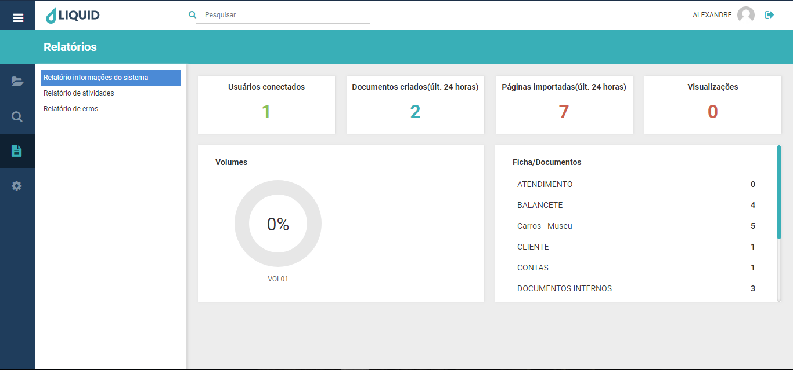

# Liquid Suite - Relatórios  

#### Relatório informações do sistema 

Exibe as principais características do sistema Liquid, como uso, quantidade de documentos e acessos.    

**Usuários conectados**: Mostra a quantidade usuários conectados ao sistema no momento presente.  
**Documentos criados (últ. 24 horas)**: informa quantos novos documentos foram criados no sistema nas últimas 24 horas.  
**Páginas importadas (últ. 24 horas)**: informa a quantidade de páginas inseridas no sistema nas últimas 24 horas.  

**Visualizações**: informa a quantidade de documentos acessados no sistema.
**Volumes**: mostra os volumes existentes no sistema, sua capacidade de armazenamento e total ocupado e livre desta capacidade.   
**Ficha/documentos**: busca a informação das fichas existentes no sistema e a quantidade de documentos criados/armazenados para cada ficha.  
**Obs.**: caso o número de fichas no sistema ultrapasse a lista visível da janela, utilize o botão central do mouse ou a barra de rolagem para exibir as demais fichas.

