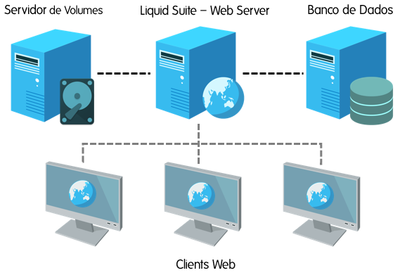

# Liquid Suite - Estrutura

### Servidores
A aplicação Liquid Suite poderá utilizar um único servidor, podendo ser distribuído em três (3) servidores: Servidor de Volumes, Web Server e Bancos de Dados.  

