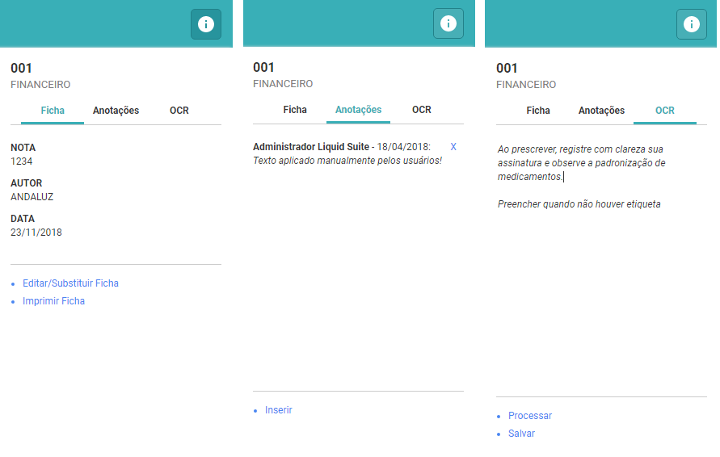

# Liquid Suite - Arquivos

#### Visualizando o documento selecionado 
 
A visualização de documentos é utilizada para visualizar as páginas do documento selecionado.  

Após pesquisa, para visualizar o conteúdo de um documento, selecione o documento e clique em *Visualizar* ou duas vezes sobre o documento.  

A esquerda temos as miniaturas do documento, clicando sobre a miniatura a imagem original é exibida no centro da janela na *manipulação da imagem*. Use a barra de rolagem ou o botão central do mouse para exibir mais miniaturas.  

No centro da janela, no painel de manipulação da imagem, é exibido as imagens do documento e as opções de manipulação de acordo com cada tipo de arquivo (extensão de imagem).  

Exemplos:  
**Documentos em PDF**, serão visualizados e terão disponíveis as ferramentas através do leitor de PDF instalado no micro do usuário.  

**Obs.:** Arquivos PDF com múltiplas-páginas (mais de uma imagem), serão exibidos e tratados no Liquid como se fosse apenas uma página, exibindo na área de miniaturas a miniatura da primeira imagem do arquivo. Uma segunda ou mais páginas (arquivos) podem ser atribuídos a este mesmo documento, assim irá constar como página dois, três e assim por diante. Ao paginar cada arquivo, as demais imagens são visualizadas.  

Na janela abaixo temos as seguintes opções para **PDF**:  
**Paginador**, permite ao usuário acessar as demais páginas do documento tanto para o fim quanto para o início.  
**Mover**, permite ao usuário modificar a posição de uma página dentro documento.  
**Lixeira**, exclui a imagem que está sendo exibida.  
Informação do nome dos arquivos visualizados.  
Informação do número total de páginas do documento e página atual visualizada.
**Girar**, rotaciona a posição da imagem na janela.  
**Download**, baixa o arquivo de imagem para o computador do usuário.  
**Imprimir**, imprime o documento selecionado.  
**Zoom**, permite aumentar ou diminuir o tamanho da visualização da imagem selecionada.  
   
  
   
**Documentos em TIF**, os documentos com esta extensão são tratados internamente pelo Liquid. As imagens de um arquivo TIF múltiplas-páginas são todas exibidas na área de miniaturas.    
   
Na janela abaixo temos as seguintes opções para **TIF**:  
**Fit**, exibe o tamanho total da imagem.  
**Zoom**, permite aumentar ou diminuir o tamanho da visualização da imagem selecionada.    
**Zoom pré-definido**, uma seleção de opção em tamanhos para visualização para a escolha do usuário.    
**Paginador**, permite ao usuário acessar as demais páginas do documento tanto para o fim quanto para o início.    
**Mover**, permite ao usuário modificar a posição de uma página dentro documento.    
**Lixeira**, exclui a imagem que está sendo exibida.    
**Girar**, rotaciona a posição da imagem na janela.    
**Download**, baixa o arquivo de imagem para o computador do usuário.    
**Imprimir**, imprime o documento selecionado.  

   
  

À direita na *Área de Informações/Ações*, temos o *título do documento*, logo abaixo o nome da *Ficha* ao qual o documento pertence e as guias:

* **Ficha**: os campos de índices da ficha e seus valores são exibidos.  
* **Anotações**: as anotações existentes para o documento realizada(s) pelo(s) usuário(s) são exibidas.  
* **OCR**: é exibido a transcrição das informações existentes na imagem para o formato de texto.  

  
Existem as opções de ações que podem ser realizadas em cada guia, disponíveis para o usuário.  

**Guia Ficha**  

* **Editar/Substituir Ficha**: exibe a janela para edição das informações de índices do documento, e permite mudar a ficha do documento. Após as alterações o botão **SALVAR** é habilitado.

  

* **Imprimir Ficha**: as informações de campos de índices do documento serão impressas.  

  

**Guia Anotações**  
* **Inserir**: uma caixa para a inserção de texto é exibida para o usuário.  

  

Após salvar, a mensagem aparecerá na área para anotações com o nome do usuário que a criou, mais a data da criação. Ao lado temos o ícone de **X** que permite ao usuário excluir a mensagem, caso tenha permissão.  

**Obs.**: Quanto à permissão de excluir as mensagens, o usuário pode excluir mensagens inseridas por outros usuários.

  

**Guia OCR**  

* Processar: Ao clicar em Processar, a mensagem de *”Processando OCR... aguarde!”* é exibida na caixa que receberá o texto transcrito da imagem.
Logo abaixo temos o item:  

* **Verificar processamento**: Permite ao usuário saber do progresso do OCR. Clicando neste item o usuário terá dois tipos de retorno. Ou é exibido o OCR da imagem, ou é exibida novamente a mensagem *”Processando OCR... aguarde!”*.

  

**Obs.**: Na caixa de OCR existe a possibilidade de edição do texto, podendo ser realizada uma correção ou até mesmo inserção de um texto completo pelo usuário. Pode-se usar “copiar e colar”.  

* **Salvar**: O botão Salvar é habilitado após o processamento do OCR e após qualquer edição realizada no texto.  

**Pasta selecionada**
* **Renomear**: Renomeia a pasta selecionada.
* **Excluir**: Excluiu a pasta selecionada.
* **Permissões**: Exibe as permissões atribuídas a pasta.  
* **Propriedades**: Exibe as propriedades da pasta.  
* **Pesquisar na pasta**: Realiza pesquisa somente na pasta.  
* **Assinar**: Assina todos os documentos contidos na pasta que possuam uma ficha para Certificação Digital.  
* **Atribuir ficha**: Atribuiu a pasta uma ficha padrão para criação de documentos.  
* **Processar OCR**: Transcreve/copia para o formato de texto as informações das imagens existentes na pasta.  
    
**Documento selecionado – Guia Detalhes** – Uma miniatura da imagem da primeira página do documento é exibida.    
* **Visualizar**: Abre a janela de visualização para o documento.  
* **Renomear**: Renomeia o documento selecionado.  
* **Excluir**: Excluiu o documento selecionado.  
* **Exportar**: Abre o painel com opções para exportar (salvar) o documento selecionado para fora do software.  
* **Permissões**: Exibe as permissões atribuídas para o documento selecionado.  
* **Propriedades**: Exibe as propriedades para o documento selecionado.  
* **Temporalidade**: Exibe a temporalidade do documento selecionado.  
* **Copiar para...**: Salva uma cópia do documento selecionado para outra pasta dentro do software.  
* **Mover para...**: Mover o documento para outra pasta de destino.  
* **Importar para...**: Cria novas imagens para o documento selecionado.  
* **Imprimir**: Imprimi a(s) imagem(s) do documento selecionado.  
* **Processar OCR**: Transcreve/copia para o formato de texto as informações da(s) imagem(s) existentes no documento.  
* **Assinar**: Assinar documento que possua uma ficha para Certificação Digital.  
* **Substituir**: Substitui documento selecionado.  
    
**Documento selecionado – Guia Ficha**– Os campos de índices atribuídos para o documento são exibidos.  
* **Editar/Substituir Ficha**: Abre o painel para edição da Ficha e índices para o documento selecionado.  
* **Imprimir Ficha**: Imprimi as informações dos índices atribuídos para o documento selecionado.  